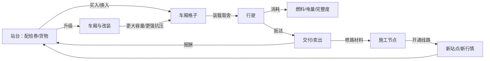
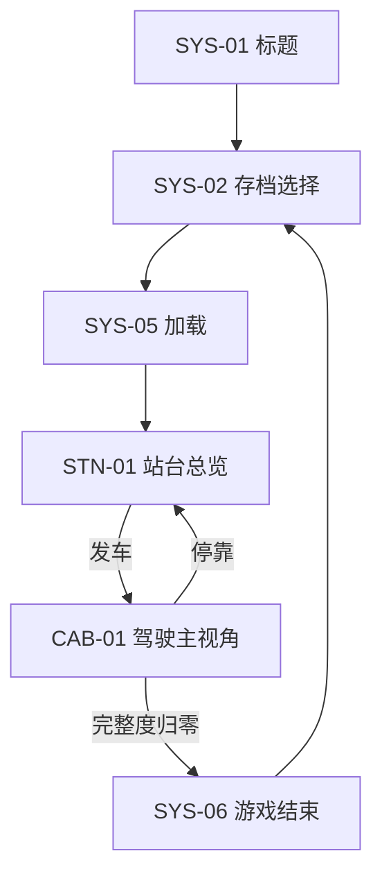
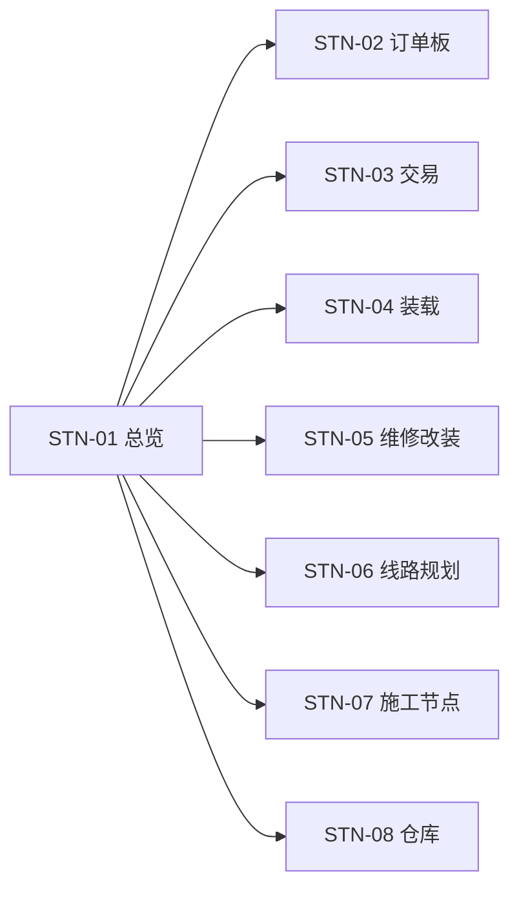
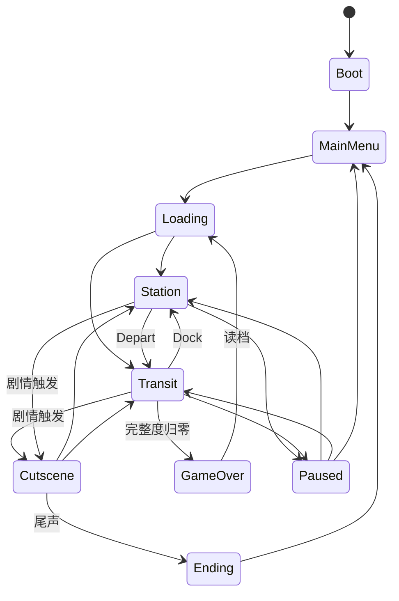
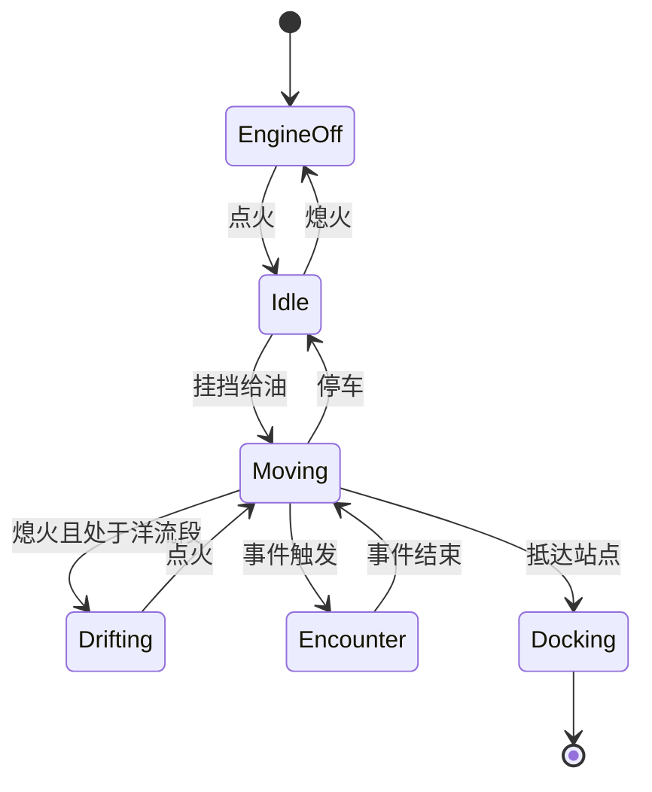

# 雾航司机 Fogline Driver 系统设计规范 v6.0

Sep 24, 2026 · @Charlie

## 1. 总则

《雾航司机》是一款第一人称、封闭驾驶舱内的轨道货运跑商＋生存模拟游戏。世界观完整沿用《雾潜者 GDD v5.0》，玩家身份从自由雾潜者改为雾航司下属的轨道车司机。本文件是所有系统的唯一规范，与本文件冲突的旧设计一律以本文件为准。

### 1.1 一句话定位

开一辆小型轨道车，在雾海中沿固定线路运货、交易、修路，靠声纳和电台活下来，送什么货就听见什么故事。

### 1.2 核心体验（按优先级）

1. **盲开的窒息感**：看不见外面，只能靠声纳、电台和仪表判断世界。
2. **精打细算的跑商**：每一格车厢空间都在货物和生存物资之间取舍。
3. **点亮线路图的满足感**：修通断轨，让灰色的地铁图一点点亮起来。
4. **货物承载的故事**：剧情由订单触发，通过电台讲述。

### 1.3 设计铁律

- **视角铁律**：驾驶阶段玩家永远在驾驶舱内，不存在车外第三人称视角。
- **轨道铁律**：所有移动沿预设轨道进行，玩家不能自由铺设新线路，只能修复预设的断点。
- **空间铁律**：货物、燃料、电池、维修材料共用同一套格子空间，没有独立的“生存物资栏”。
- **噪音铁律**：所有会发声的行为（加速、刹车、主动声纳、发射电台、发声货物）都计入噪音场，噪音是驾驶阶段的核心成本。
- **叙事铁律**：剧情线性、单结局；阵营只存在于叙事中，不做阵营声望系统。
- **站点铁律**：站点不做可自由行走的3D场景，只做固定视角的站台界面。

### 1.4 范围边界（明确不做）

- 不做自由驾驶地图、不做轨道编辑器。
- 不做车外战斗和武器系统，对抗手段只有规避、诱饵、干扰和逃跑。
- 不做多结局、不做阵营声望。
- 不做多人联机。

## 2. 核心玩法

游戏由七个玩法模块组成：驾驶、声纳、电台、装载、交易、订单、修路。前三个发生在驾驶阶段，后四个发生在站台阶段。

| 模块 | 发生阶段 | 玩家做什么 | 核心取舍 |
| --- | --- | --- | --- |
| 驾驶 | 行驶 | 点火、挂挡、油门刹车、道岔选择 | 速度与噪音 |
| 声纳 | 行驶 | 看被动瀑布图，必要时主动发波 | 信息与暴露 |
| 电台 | 行驶/站台 | 调频收听，必要时按 PTT 发射 | 情报与暴露 |
| 装载 | 站台 | 在车厢格子中摆放货物和物资 | 利润与生存余量 |
| 交易 | 站台 | 以物换物、买卖货物 | 差价与空间 |
| 订单 | 站台 | 接受、交付订单 | 报酬、剧情与风险 |
| 修路 | 站台/施工点 | 向施工节点投入材料 | 眼前收益与长期扩张 |

### 2.1 驾驶

- **操作**：长按点火；挡位 P/R/N/D/L；W 油门、S 刹车，给油有延迟；道岔处按键选择分支。
- **轨道约束**：车只能沿轨道前进或后退，转向由道岔决定，没有方向盘自由转向。
- **噪音规则**：转速越高噪音越大；急刹产生高噪音摩擦声；L 挡下坡可用引擎制动降低刹车噪音；熄火为绝对静音但无法移动（洋流段除外）。
- **迷雾洋流**：部分线路段有洋流，顺流可熄火滑行、不耗燃料，逆流耗油加倍。

### 2.2 声纳

- **被动声纳**：常开、静默、极低电耗。以瀑布图显示周围声源的频率与左右方位，每类怪物和机械有固定声纹。
- **主动声纳**：长按发波，消耗大量电量，在挡风玻璃屏上显示前方轨道、障碍与怪物的回波轮廓，回波随时间褪色。发波瞬间产生高噪音。
- **频率**：低频看得远但模糊，高频看得清但距离短。
- **声学共振**：调频到某物体的固有频率定向发波，可让发声物体成为诱饵，或震碎脆弱障碍。

### 2.3 电台

- **接收（Rx）**：隐蔽、低电耗。可收听的频段由当前雾压决定：低压区收 VHF/UHF 语音，高压区只剩 VLF 的摩斯码与 SSTV。
- **发射（Tx）**：按住 PTT 发射，耗电并成为电磁信号源，会被静默阵线和怪物定位。用于回复调度、与收货人对话、干扰敌方。
- **信息作用**：电台是行情、雾况、订单剧情和传闻的唯一来源，详见第 3、4 章。

### 2.4 装载

- 每节车厢是一块格子网格，货物有形状和体积，可旋转摆放。
- 货物带属性标签：**重量**（影响油耗和速度）、**噪音**（叠加到噪音场）、**易碎**（颠簸和冲击会损坏）、**怕压**（超过雾压阈值会损坏）、**活物**（需要消耗补给）。
- 部分车厢有特殊属性，如隔音车厢可屏蔽发声货物的噪音。

### 2.5 交易

- 每个站点有“缺货标签”和“余货标签”，价格由标签、距离、线路风险自动计算，不手写单价。
- 支持两种方式：用雾航司配给券买卖，或以物换物。以物换物时，站点对自己缺的货给出溢价。
- 电台广播的事件（断粮、罢工、雾潮）会临时修改站点标签。

### 2.6 订单

| 订单类型 | 来源 | 作用 |
| --- | --- | --- |
| 主线订单 | 剧情推进 | 推进主线，必须完成才能进入下一幕 |
| 人物订单 | 固定收货人 | 连续交付解锁该人物的故事段落 |
| 雾航司派单 | 调度塔台 | 稳定收入，有时限要求 |
| 修路订单 | 施工节点 | 运送指定材料，完成后开通线路 |

- 订单货物与普通货物使用同一套货物系统，仅额外挂载订单标签和剧情触发器。
- 订单货物损坏会降低报酬，完全损毁则订单失败。

### 2.7 修路

- 线路图上的断轨、塌方、雾淹段为预设施工节点。
- 每个节点需要一组指定材料，可分多次投入，进度保留。
- 节点完成后，对应线路在线路图上亮起，开放新站点、捷径或新订单来源。

## 3. 资源定义与资源循环

资源分为四层：车辆状态、实体物资、货币与信息、长期进度。实体物资全部占用车厢格子，这是整个资源循环的约束核心。

### 3.1 资源表

| 资源 | 层级 | 占格子 | 获得方式 | 消耗方式 | 归零后果 |
| --- | --- | --- | --- | --- | --- |
| 完整度 | 车辆状态 | 否 | 维修（消耗维修材料或在站台付费） | 超压、怪物攻击、碰撞 | 任一分区报废即失去该分区功能；全部报废则游戏结束 |
| 燃料 | 车辆状态 | 否（储量）/ 是（备用桶） | 站台购买、以物换物 | 点火、行驶、逆洋流 | 无法行驶，只能等待洋流或救援 |
| 电量 | 车辆状态 | 否（储量）/ 是（备用电池） | 高转速充电（产生噪音）、站台充电 | 声纳、电台、主动发波、发射 | 无法主动发波和发射，被动声纳降级 |
| 噪音 | 车辆状态 | 否 | 所有发声行为 | 随时间自然衰减 | 超过阈值触发怪物追踪 |
| 货物 | 实体物资 | 是 | 交易、订单领取 | 交易、订单交付 | — |
| 维修材料 | 实体物资 | 是 | 交易、拾取 | 维修、修路 | 无法在途中维修 |
| 修路材料 | 实体物资 | 是 | 交易、修路订单 | 投入施工节点 | — |
| 配给券 | 货币 | 否 | 订单报酬、卖货 | 买货、维修、升级 | 只能以物换物 |
| 情报 | 信息 | 否 | 电台收听、解密 | 用于决策，不消耗 | — |
| 车厢与改装 | 长期进度 | — | 用配给券或材料购买 | 永久持有 | — |
| 已开通线路 | 长期进度 | — | 修路 | 永久持有 | — |
| 剧情进度 | 长期进度 | — | 交付主线和人物订单 | 永久持有 | — |

### 3.2 资源循环

循环的核心张力：**货多利润高，但备用燃料、电池、维修材料就少**；**深线利润高，但完整度和电量消耗快**。升级车厢扩大空间和抗压，但会让车更重、更吵。

### 3.3 数值平衡原则

- 每趟行程的燃料消耗应占满油量的 30%–60%，逼迫玩家在中途站补给或携带备用桶。
- 主动声纳单次消耗约为满电量的 10%–15%，一趟行程内无法无脑连发。
- 深线订单报酬约为同距离浅线的 2–3 倍，确保冒险有回报。
- 修路材料的总需求应让玩家在每个阶段花费约 30% 的运力在修路上。

## 4. 玩法循环

玩法循环分三层：单趟循环（10–20 分钟）、阶段循环（一幕剧情，约 2–4 小时）、长期循环（整局游戏）。每一层都由下一层驱动。

### 4.1 单趟循环

1. **接单/交易**：查看订单板和行情，决定这趟运什么。
2. **装载**：在车厢格子中摆放货物和备用物资。
3. **规划路线**：在线路图上选择途经站点和道岔，查看各段雾压和已知风险。
4. **行驶与事件**：驾驶、监听、规避；可能遭遇怪物、静默阵线封锁、断轨、雾潮、求救信号。
5. **抵达**：交付订单、卖货、维修、补给，进入下一趟。

### 4.2 行驶中的事件类型

| 事件 | 触发方式 | 玩家应对 |
| --- | --- | --- |
| 怪物游弋 | 路段随机 + 噪音场 | 熄火静默、诱饵、加速逃离 |
| 怪物追击 | 噪音超过阈值 | 声学诱饵、加速、进入洋流段 |
| 静默阵线封锁 | 固定巡逻路线 | 绕行、主动声纳定位后穿越、电磁干扰 |
| 断轨/落石 | 路段预设或随机 | 倒车改道、声学共振震碎障碍 |
| 雾潮 | 电台预报（不准） | 提前停靠或加速通过 |
| 求救信号 | 电台 | 选择救援（耗时）或无视 |
| 剧情通话 | 订单货物触发 | 收听，必要时 PTT 回复 |

### 4.3 阶段循环（一幕）

1. 抵达新区域，线路图大部分为灰色。
2. 接取本幕主线订单，得知需要开通的关键线路。
3. 通过派单和跑商积累配给券和修路材料。
4. 修通施工节点，解锁新站点和人物订单。
5. 升级车厢以承受更深的线路。
6. 完成本幕最后一单主线订单，进入下一幕。

### 4.4 长期循环（整局）

- **空间扩张**：线路图从青藏岛周边逐步向下延伸，直至零号海沟。
- **车辆成长**：从单节车厢到多节编组，从浅线抗压到深线抗压。
- **叙事推进**：序幕（黑盒）→ 第一幕（漩涡）→ 第二幕（航线）→ 第三幕（深渊）→ 尾声，沿用 v5.0 剧情结构，由主线订单串联。

## 5. 界面分类

界面分为四类：系统界面、驾驶舱界面、站台界面、叠加层。驾驶舱和站台内的界面都是 3D 空间中的实体面板，不使用传统菜单；只有系统界面允许使用 2D 菜单。

### 5.1 系统界面（2D）

| 编号 | 界面 | 内容 |
| --- | --- | --- |
| SYS-01 | 启动/标题 | 开始、继续、设置、退出 |
| SYS-02 | 存档选择 | 存档列表，显示当前幕、所在站点、游戏时长 |
| SYS-03 | 设置 | 画面、音频、麦克风、按键 |
| SYS-04 | 暂停菜单 | 继续、设置、返回标题 |
| SYS-05 | 加载 | 过场加载，显示电台底噪和线路图局部 |
| SYS-06 | 游戏结束 | 失败原因、读取最近存档 |

### 5.2 驾驶舱界面（3D 实体，行驶中）

| 编号 | 界面 | 位置 | 内容 |
| --- | --- | --- | --- |
| CAB-01 | 驾驶主视角 | 默认 | 挡风玻璃声纳屏、仪表、方向控制 |
| CAB-02 | 左侧航行面板 | 看向左侧 | 测高仪（海拔/雾压）、车速、油量、电量、分区完整度 |
| CAB-03 | 中部通讯面板 | 看向中部 | 电台旋钮、静噪推杆、被动声纳瀑布图 |
| CAB-04 | 右侧动力面板 | 看向右侧 | 挡位杆、VU 噪音计、Rx/Tx 开关、发波键 |
| CAB-05 | 线路图面板 | 看向上方或按键 | 实时线路图、当前位置、已知风险、道岔预选 |
| CAB-06 | 车厢视图 | 按 Shift 转身 | 当前车厢格子，可整理物资、途中维修 |

### 5.3 站台界面（固定视角）

| 编号 | 界面 | 内容 |
| --- | --- | --- |
| STN-01 | 站台总览 | 站名、站点状态、可前往的功能窗口 |
| STN-02 | 订单板 | 可接订单、已接订单、交付 |
| STN-03 | 交易窗口 | 左侧车厢格子、右侧站点货物，买卖与以物换物 |
| STN-04 | 装载界面 | 全车厢编组视图，整理货物和物资摆放 |
| STN-05 | 维修/改装 | 维修分区、购买车厢、安装改装件 |
| STN-06 | 线路规划 | 大线路图，选择下一段路线与道岔 |
| STN-07 | 施工节点 | 所需材料、已投入进度、投入操作（仅在施工点或相邻站台出现） |
| STN-08 | 仓库 | 仅在雾航司站点可用，无限容量存放 |

### 5.4 叠加层（不切换界面，覆盖在当前视图上）

| 编号 | 叠加层 | 触发 |
| --- | --- | --- |
| OVL-01 | 电台字幕 | 收到语音广播或剧情通话 |
| OVL-02 | 交互提示 | 视线停留在可操作的实体面板上 |
| OVL-03 | 警报 | 超压、分区损坏、燃料/电量过低 |
| OVL-04 | 剧情对话选择 | 需要 PTT 回复时提供文本选项（麦克风输入的后备方案） |
| OVL-05 | 教程提示 | 首次遇到新机制 |

## 6. 界面跳转逻辑

跳转分三层：系统层在任何时候可由 Esc 进入暂停；驾驶舱内的面板切换是视角移动，不改变游戏状态；站台与驾驶舱之间的切换必须经过“停靠”和“发车”两个动作。

### 6.1 顶层跳转

### 6.2 驾驶舱内跳转

- CAB-01 为中心，CAB-02/03/04 通过鼠标视角或快捷键切换，切换时游戏不暂停。
- CAB-05 线路图：按 M 或抬头查看，游戏不暂停，车辆继续行驶。
- CAB-06 车厢视图：按 Shift 转身；转身期间车辆保持当前挡位和油门，玩家看不到前方仪表，这是有意设计的风险。
- 任意驾驶舱界面按 Esc 进入 SYS-04，游戏暂停。

### 6.3 站台内跳转

- 所有站台子界面只能返回 STN-01，子界面之间不直接跳转。例外：STN-02 接单后可一键进入 STN-04 装载订单货物。
- 站台界面中时间暂停，驾驶舱时间不流逝。
- 发车前置条件：已在 STN-06 选好下一段路线；所有已接订单货物已装车；燃料大于零。不满足时发车按钮置灰并显示原因。

### 6.4 叠加层规则

- 叠加层不改变当前界面与游戏状态，可与任何驾驶舱界面并存。
- 同时只显示一个 OVL-04 剧情对话选择；警报 OVL-03 优先级最高，覆盖其他叠加层。
- 剧情通话在行驶中触发时不暂停游戏，玩家必须边开车边听。

## 7. Game State 状态机

Game State 分三级：全局状态（GameState）管理游戏整体流程；阶段子状态（Station/Transit）管理站台与行驶内部；车辆状态（VehicleState）独立并行，只在 Transit 中更新。任一时刻只能处于一个全局状态。

### 7.1 全局状态

| 状态 | 时间流逝 | 可存档 | 说明 |
| --- | --- | --- | --- |
| Boot | — | 否 | 初始化服务、读取设置 |
| MainMenu | 否 | 否 | SYS-01/02/03 |
| Loading | 否 | 否 | 加载场景和存档数据 |
| Station | 否 | 是（自动） | 所有站台界面 |
| Transit | 是 | 否 | 所有驾驶舱界面 |
| Cutscene | 视剧情 | 否 | 固定演出，如序幕、幕间、尾声 |
| Paused | 否 | 否 | 记录暂停前的状态，恢复时返回 |
| GameOver | 否 | 否 | 显示失败原因 |
| Ending | 否 | 否 | 尾声与制作名单 |

### 7.2 Station 子状态

| 子状态 | 对应界面 |
| --- | --- |
| Overview | STN-01 |
| Contracts | STN-02 |
| Trading | STN-03 |
| Loading | STN-04 |
| Workshop | STN-05 |
| RoutePlanning | STN-06 |
| Construction | STN-07 |
| Storage | STN-08 |

所有子状态只与 Overview 互相转换（Contracts → Loading 例外）。进入 Station 时自动存档。

### 7.3 Transit 子状态

- **EngineOff**：绝对静音，无法移动，电量仅供被动设备。
- **Idle**：引擎怠速，低噪音，可充电。
- **Moving**：正常行驶，噪音随转速变化。
- **Drifting**：随洋流滑行，零油耗，低噪音。
- **Encounter**：事件进行中，如怪物追击、封锁、断轨，事件本身有自己的子流程。
- **Docking**：进站动画，结束后全局状态切换到 Station。

### 7.4 车辆状态（并行）

| 字段 | 类型 | 说明 |
| --- | --- | --- |
| integrity\[车头/车厢n/底盘\] | float 0–100 | 分区完整度，低于 30 进入报废警告 |
| fuel | float | 当前燃料 |
| battery | float | 当前电量 |
| noise | float | 当前噪音场强度，随时间衰减 |
| pressureLimit | float | 当前编组能承受的最大雾压 |
| gear | enum P/R/N/D/L | 当前挡位 |
| rpm | float | 转速，决定速度、噪音、充电速率 |
| consist | list | 车厢编组及各车厢格子内容 |

### 7.5 全局存档数据

- 当前幕与主线订单进度。
- 已开通线路、各施工节点投入进度。
- 车厢编组、改装、格子内容、仓库内容。
- 配给券、已接订单、人物订单进度。
- 各站点当前缺货/余货标签与活跃事件。
- 当前所在站点（只在 Station 存档，因此读档一定回到站台）。

## 8. 最小切片范围与验收标准

第一个可玩切片只做一条线路、四个站点、一个施工节点，覆盖序幕到第一幕开头。目标是验证“装货—开车—活下来—卖货—修路”这个循环本身是否好玩。

### 8.1 切片内容

| 项目 | 数量 | 说明 |
| --- | --- | --- |
| 线路 | 1 条主线 + 1 条待修支线 | 支线通过施工节点开通 |
| 站点 | 4 个 | 起点游牧民中转站、2 个中途站、青藏岛外围站 |
| 施工节点 | 1 个 | 开通支线，缩短到青藏岛的路程 |
| 货物种类 | 8 种 | 覆盖重量、噪音、易碎、怕压、活物各属性至少一次 |
| 车厢 | 2 种 | 货运车厢、燃料车厢 |
| 怪物 | 1 种 | 听觉追踪型，靠噪音触发 |
| 事件 | 3 种 | 怪物追击、断轨、雾潮 |
| 电台频道 | 3 个 | 航司塔台、雾气预报、黑盒 VLF |
| 剧情订单 | 1 条 | 黑盒序幕，交付后进入第一幕 |

### 8.2 系统实现顺序

1. GameState 状态机与 Station/Transit 切换。
2. 轨道驾驶（沿样条曲线移动、挡位、油门、道岔）。
3. 车辆资源（燃料、电量、完整度、噪音）。
4. 格子装载与货物属性。
5. 站台界面：订单板、交易、装载、线路规划。
6. 被动声纳与主动声纳。
7. 电台接收与频段衰减。
8. 怪物 AI（噪音追踪）与事件系统。
9. 施工节点与线路图点亮。
10. 剧情订单触发与电台剧情通话。

### 8.3 验收标准

- [ ] 玩家能在不看教程的情况下完成一次“接单—装载—行驶—交付”。
- [ ] 每趟出发前，玩家至少面临一次“多装货还是多带物资”的取舍。
- [ ] 行驶中至少出现一次需要主动管理噪音的时刻。
- [ ] 修通施工节点后，线路图亮起，玩家能明显感到路程变短或收益变高。
- [ ] 黑盒剧情订单能通过电台完整讲完序幕。
- [ ] 读档一定回到站台，状态与存档前一致。
