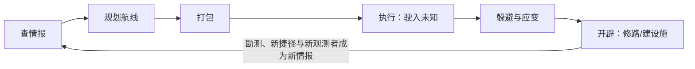
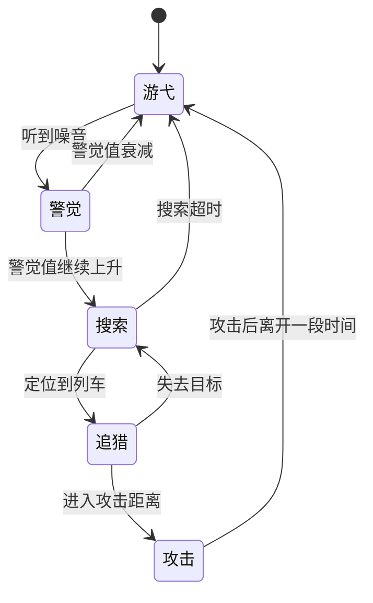
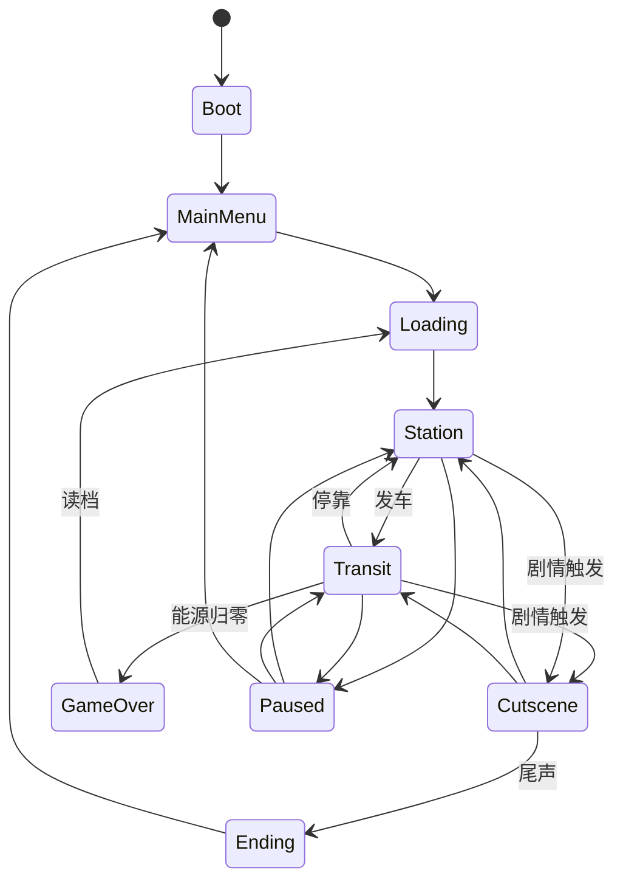
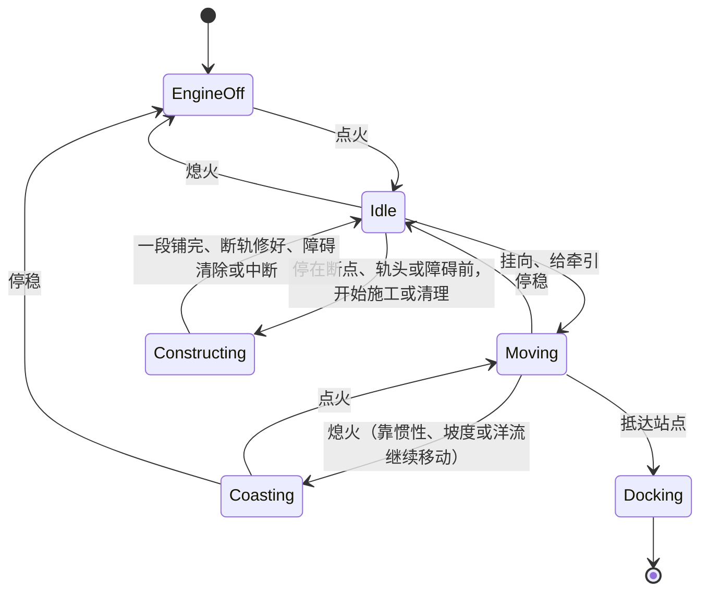

# 雾航司机 Fogline Driver 系统设计规范 v6.1

Oct 5, 2026 · @Charlie

## 0. 版本说明

v6.1 从第一性原理重新收敛了玩法：**地图本身就是游戏**。本文件是所有系统的唯一规范，取代 v6.0；与本文件冲突的旧设计一律以本文件为准。世界观仍沿用《雾潜者 GDD v5.0》。相对 v6.0 的变更汇总见第 18 章。

## 1. 总则

### 1.1 一句话定位

坐在封闭的轨道车里，对着一张不可靠的旧线路图查情报、规划航线、驶入未知、躲开雾中的猎手，把一条条断轨修成自己的网络。

### 1.2 核心体验（按优先级）

1. **规划**：在海图上综合勘测、通告与潮汐预测，自己找出一条可行的路，像看地铁图想换乘、像航海家看海图算潮窗。
2. **驶入未知**：把路线押进只有旧地图的区域，亲眼看着声纳把真实地形一点点扫出来。
3. **冷静应对压迫**：环境是持续的主要威胁，猎手是偶尔逼近的心理压力。玩家能做的只有停、退、换线、熄火、藏。
4. **开辟**：在有限材料下选择修哪几条路、在哪些节点建设施，让网络和捷径成形，像银河城打开捷径、像 Mini Motorways 和 MST 那样做网络设计。

### 1.3 核心循环

打包、送货、打捞是辅助系统：打包服务于规划，送货提供目的地，打捞奖励进入未知。它们保持浅而清晰，不追求深度。

### 1.4 设计铁律

- **海图铁律**：所有情报都以海图标记的形式呈现，带位置、时间、来源、可信度四个属性。没有独立的情报、日志或任务界面。
- **记录铁律**：系统负责测量和记录，玩家只负责判断。地形、轨道、接触目标、通告都自动写入海图；玩家不需要手动画图、手动定位或手动三角测量。
- **判断铁律**：系统不替玩家做路线决策。不做自动寻路、自动驾驶、自动扳道岔。
- **视角铁律**：驾驶阶段玩家始终在驾驶舱内，主屏就是海图；不存在车外视角。
- **轨道铁律**：列车只能沿轨道移动。建造只发生在节点和边上，所有可建的边和设施位都是预设的，并且**数量始终多于玩家能获得的材料**。
- **世界铁律**：雾海是一片连续空间，轨道网络只是嵌在其中的一张图。环境场和猎手存在于连续雾海中，不受轨道约束。
- **真实情报铁律**：雾航通告来自世界中真实发生的观测，经由真实的广播站、覆盖范围和播出时段传播，不凭空生成。
- **单一生命值铁律**：**能源**是唯一决定生死的数值，只能通过格子物品（燃料罐）或在站点恢复。
- **空间铁律**：货物、燃料罐、工具、建造材料共用同一套车厢格子。
- **噪音铁律**：所有发声行为都会计入噪音，噪音是猎手追踪玩家的唯一依据。
- **无货币铁律**：游戏中没有货币。报酬直接以物品、材料、情报的形式发放。
- **叙事铁律**：剧情线性、单结局；阵营只存在于叙事中，不做声望系统。
- **站点铁律**：站点不做可自由行走的 3D 场景，只做固定视角的站台界面。

### 1.5 范围边界（明确不做）

- 不做交易、市场、价格系统和货币。
- 不做自由铺轨，也不做轨道编辑器。
- 不做自动寻路、自动驾驶和自动扳道岔。
- 不做车外战斗和武器，对抗手段只有规避、诱饵、隐藏和逃跑。
- 不做多结局和阵营声望。
- 不做多人联机。
- 暂不做其他列车与调度系统（远期可能加入其他轨道运输员，届时另行设计）。

## 2. 世界模型

世界在逻辑上是 2D 的：一张俯视的雾海，深度只是一个标量。3D 只负责驾驶舱外壳和站台场景。

### 2.1 三层结构

| 层 | 内容 | 谁在上面移动 |
| --- | --- | --- |
| **雾海** | 连续空间，包括深度场、洋流场和地形（山脊、隧道等，会遮挡声音） | 猎手、雾象 |
| **轨道图** | 节点（站点、道岔、残骸、施工点、设施位）和边（有真实长度的轨道曲线） | 列车 |
| **时间** | 全局时钟，驱动潮汐、洋流变化、预报事件、广播时段和委托期限 | — |

### 2.2 节点类型

| 类型 | 说明 |
| --- | --- |
| 站点 | 可停靠，进入站台界面；接入网络后成为观测者和广播站，并提供产出 |
| 道岔 | 一条轨道分成两条的地方，见 4.3 |
| 残骸 | 可打捞的节点，是探索的奖励 |
| 设施位 | 可以建造信标、中继站或避难所的预设位置 |
| 施工点 | 断轨的断点，或候选边的起点；新线从这里开始边开边修 |

### 2.3 边的几何

- 每条边都是雾海中的一条**真实曲线**，沿地形弯曲，有真实长度和坡度。
- 列车沿边**连续移动**，位置记为 `(edgeId, t)`。一条边途经的深度和洋流各处不同，玩家在边的中途就可能遇到涨潮、逆流或猎手。
- 长度决定通过时间和能源消耗。
- 每条边按固定长度切分为若干**段**，作为修建的计量单位（见 10.1）。

### 2.4 边的状态

| 状态 | 说明 |
| --- | --- |
| 已开通 | 可以通行 |
| 断轨 | 原本存在、在某一点损坏的边，修复该点后开通 |
| 候选 | 可以新建的预设边，旧地图上可能有、也可能没有；修建中的候选边，已铺部分可以通行，尽头是**轨头** |
| 未知 | 旧地图上画着，但从未被勘测确认，实际状态和长度可能与图上不同 |

### 2.5 轨道障碍

未知或久未勘测的路段上可能存在障碍。障碍是**静默**的，被动声纳发现不了，只有主动声纳或亲自开到跟前才能看到。

| 障碍 | 处理方式 |
| --- | --- |
| 落石 | 停车后花时间清理，清理过程会产生噪音 |
| 未知断轨 | 用轨件修复，或者倒车改道 |

- **撞上障碍**：速度超过安全阈值时，按速度损失能源，易碎货物受损，列车被迫停下。低速时可以安全停住。
- 这条规则让"制动距离必须短于视距"成为驶入未知时的核心约束（见 4.5）。

## 3. 海图

海图是游戏的主舞台：它既是驾驶舱主屏（CAB-01），也是站台的海图台（STN-05）。除车辆仪表和车厢格子外，所有信息都在海图上呈现。设计参考真实海运：航海图、航海通告（Notice to Mariners）、NAVTEX 航行警告、潮汐表，以及电子海图系统 ECDIS。

### 3.1 四个图层（由下到上）

| 图层 | 内容 | 可信度 | 视觉 |
| --- | --- | --- | --- |
| **旧地图** | 旧时代印刷的地铁示意图，开局即拥有 | 不可靠：有的线已断，有的站已改名，有的路图上没有；距离和形状失真 | 泛黄的印刷底图，只用 45° 和 90° 的线 |
| **勘测层** | 列车走过的边、声纳扫过的地形和静止物体，自动写入 | 写入时可靠，但会随时间变旧 | 清晰的实线和等深线 |
| **标注层** | 玩家的手动标注、雾航通告、站点勘测图等带时间戳的情报 | 取决于来源 | 手写或印章风格的标记 |
| **实时层** | 列车位置、接触目标（见第 5 章）、主动声纳回波 | 当前时刻 | 发光的符号 |

旧地图的作用是**引导**：告诉玩家前方"可能"有什么。真正可靠的规划依据是勘测层。路线一旦伸进只有旧地图的区域，就是在押注，这正是探索。

### 3.2 位置与旧地图比对

- 列车行驶在轨道上，所以**列车在勘测层上的位置永远精确**。"我在哪"从来不是问题；真正的问题是"旧地图说前面有路，它说得对吗"。
- 到达一个新节点时，系统自动把它与旧地图上对应的站点或道岔比对，在旧地图上打勾（属实）或打叉（不符），并记录真实名称和位置。

### 3.3 示意图与实测

- 旧地图是 Harry Beck 式的地铁示意图：方正，站距均匀。它**拓扑大致正确，但距离和形状都是失真的**。
- 勘测层画出的是轨道的真实形状和长度。旧地图上看着很近的两站，实际可能隔着一条绕山的长弯道；**真实长度只有勘测之后才知道**。
- **示意视图**只在站台海图台（STN-05）提供：根据玩家已开通的网络，自动生成一张方正的线路图，用来整体规划和欣赏自己的网络。驾驶舱内只使用实测视图。

### 3.4 缩放

海图不切换模式，只有两档缩放，用滚轮或一个按键切换：

| 档位 | 视野 | 显示重点 |
| --- | --- | --- |
| **近景**（驾驶默认） | 跟随列车，约为被动声纳范围的两倍 | 接触目标、地形细节、前方道岔与障碍 |
| **远景** | 整个区域 | 航线、潮位、标注、整个网络 |

### 3.5 标记模型

每条情报都是海图上的一个标记：

| 属性 | 说明 | 示例 |
| --- | --- | --- |
| 位置 | 节点、边，或雾海中的一个区域 | 5号线 K12 处 |
| 时间 | 观测时刻或预测时刻 | 3 小时前 / 预计 18:00 |
| 来源 | 自己勘测、某个站点或中继站、气象台、匿名信号 | 灯塔站 |
| 可信度 | 决定标记的显示方式：实线、虚线、问号 | 高 / 中 / 低 |

- **标记会过期**：会动的目标（猎手）的标记随时间褪色，过了有效期自动移除；勘测数据也会变旧（例如乱流改变了地形）。
- 标记类型包括：断轨、障碍、地形变化、猎手目击、雾象预警、残骸、信号源，以及玩家的自由标注。
- 玩家唯一的手动操作是**放标注**：在海图上放一个图钉，写一句话。标注是可选的，不放也不影响游戏。

### 3.6 情报渠道

渠道只负责把情报写进海图，本身不是独立系统。

| 渠道 | 写入什么 | 时机 | 详见 |
| --- | --- | --- | --- |
| 被动声纳 | 近处地形；声源接触 | 持续 | 5.1 |
| 主动声纳 | 前方远处的地形、静止物体，以及所有目标的当时位置 | 玩家发波时 | 5.2 |
| 站点勘测图 | 附近区段的勘测数据，来源标为该站点（参考空洞骑士的 Cornifer） | 停靠时，或作为委托报酬 | — |
| 雾航通告 | 观测者记录的真实事件 | 广播时段，且玩家在覆盖范围内 | 第 6 章 |
| 剧情通话 | 剧情语音，同时在图上留下相关标记 | 由委托触发，经由广播系统播出 | 6.5 |

### 3.7 时间轴

- 海图下方有一条时间滑杆，向未来拖动可以查看**预测的潮位、洋流和预报事件**。
- 拖得越远，预测越模糊：显示范围变宽，可信度下降。
- **雾啸**等事件以不确定性锥的形式显示，类似台风路径预报图。
- 潮汐有固定周期，可以精确预测；雾啸只能靠预报，并且预报不一定准。

### 3.8 航线规划

- **本区域所有已知的边始终显示在海图上**，包括已开通、未知、断轨和候选的边。系统**不给出候选航线**。
- 玩家自己逐个点选节点，拼出一条航线。系统不做寻路，只负责**算账**。
- **悬停查看**：悬停在任意一条边上，显示它的已知信息：长度（未勘测时为区间）、深度剖面、坡度、洋流、上次勘测的时间，以及沿途的标记。
- **深度着色**：开启后，所有边按"相对于当前耐压上限有多深"染色；拖动时间轴，颜色随潮位变化。
- **航线汇总**：
  - 总距离：已勘测路段为真实长度，未知路段按旧地图估算并显示为区间；
  - 预计能源消耗：同样只有已勘测路段是精确的；
  - 沿途超过耐压上限的路段（随出发时刻变化）；
  - 与时间轴联动的到达时刻，以及该时刻的潮位。
- 航线只是计划：显示为亮线，但不会自动驾驶，也不会自动扳道岔。行驶中可以随时偏离或重新规划。

## 4. 驾驶

驾驶模拟真实机车：没有方向盘，玩家管理的是**动力、制动和惯性**。

### 4.1 操纵件

| 操纵件 | 说明 |
| --- | --- |
| 点火 / 熄火 | 熄火后绝对静音，但无法自主移动（洋流段和下坡可以滑行） |
| 方向手柄 | 前进 / 中立 / 后退。必须停稳才能换向 |
| 牵引手柄 | 分级（0–8 级）。推上去之后，动力有延迟才会上来 |
| 制动手柄 | 分级制动。制动越重，摩擦声越大 |
| 紧急制动 | 最短距离停车，但噪音极大，并可能损伤易碎货物 |
| 道岔扳动 | 扳动前方最近的一个道岔，见 4.3 |

列车在主屏海图上显示为一个实时移动的点。

### 4.2 物理

- **质量**：货物和车厢的总重量影响加速和**制动距离**。装得越满，越难停下来，因此打包直接影响驾驶。
- **坡度与洋流**：作为外力推动列车。下坡和顺流时需要提前制动；逆流和上坡时更耗能源。
- **驾驶技巧就是管理惯性**：提前多远收牵引、多早开始制动，怎样不急刹就停在轨头、道岔或站台前。

### 4.3 道岔

- 道岔是**一条轨道分成两条**的地方。它有两个位置，例如"左股"和"右股"；**列车会驶入道岔当前指向的那条线**。
- **对向进入**（从"一条"驶向"两条"那一侧）：必须在到达之前，把道岔扳到想走的那一股。
- **顺向进入**（从"两条"中的某一股驶向"一条"那一侧）：不需要选择，直接通过。
- **操作**：海图上高亮前方最近的一个对向道岔，并显示它当前的指向；按一个键扳动。列车压在道岔上时不能扳动。
- **扳错或者忘了扳**：列车会驶入另一条线。只能停车、换向后退，退过道岔后扳回，再重新前进。被追击时犯这个错非常致命，这是有意设计的风险。
- 系统不会根据规划的航线自动扳道岔。

### 4.4 快、静、省

速度越快，**噪音越大、能源消耗越快**，但到达更早，更容易赶上潮窗。**快、静、省三者只能兼顾两个**，这是驾驶阶段最核心的持续决策。车体换装（见 11.4）只改变偏向哪两项，不会消除这个取舍。

### 4.5 制动距离与视距

在未知路段，**制动距离必须短于视距**，否则可能撞上看不见的障碍。

- 只靠被动声纳时，视距很短，只能低速前进。
- 发一次主动声纳后，前方很远都可以看清，可以放心加速。
- 主动声纳的本质，是**用能源和噪音换速度与安全**。

## 5. 侦测

### 5.1 被动声纳

- 常开、静默、耗能极低。
- **范围很短**：列车周围一小圈。
- 自动把圈内的粗略地形写入勘测层。
- **只能发现会发声的东西**：猎手、洋流的轰鸣、残骸的异响。静默的障碍、残骸和潜伏的猎手，它都发现不了。
- 发现的声源以**接触目标**的形式显示在实时层（见 5.3）。

### 5.2 主动声纳

- 长按发波：消耗大量能源，产生高噪音，并且会特别吸引 EMP 型猎手（见 8.5）。
- **范围很远**：前方一个大扇形。
- **能看到所有东西，包括静默的**：落石、断轨、残骸、隐藏的岔路，以及静止潜伏的猎手。
- 结果是**那一瞬间的快照，之后一直显示**：
  - 静止的东西（地形、障碍、残骸）写入勘测层，永久保留，直到被新的勘测覆盖；
  - 会动的东西（猎手）以那一刻的位置留下带时间戳的标记，之后逐渐褪色。

### 5.3 接触目标

被动声纳发现的声源，按精度分为三级，全部显示在实时层：

| 等级 | 条件 | 海图显示 |
| --- | --- | --- |
| **方位** | 初始能力：被动声纳听到 | 从列车伸出的一段模糊扇形区域。方向由声纳测出，远近由响度粗估；声音越强，扇形越窄、越短 |
| **估计位置** | 已安装**测向仪**（见 11.2），且列车在移动中；或者在中继站覆盖范围内 | 自动三角定位，扇形收缩成一个不确定椭圆。列车移动得越久、角度变化越大，椭圆越小。椭圆足够小时，显示目标大致的移动方向 |
| **确认** | 主动声纳回波 | 精确光点，之后转为带时间戳的标记并褪色 |

- 目标停止发声后，它的接触显示会逐渐扩散、变淡，直到消失。
- 三角定位完全自动，玩家不需要任何手动操作。

### 5.4 声音

- 驾驶舱使用三维音效，玩家可以凭耳朵判断声源的方向。
- **猎手当前的行为阶段通过声音传达，而不是界面**：游弋时是低沉的远鸣，搜索时是断续的探测声，追猎时是越来越近、越来越急的声音。

## 6. 雾航通告

雾航通告是一个**真实模拟**的情报网络：每一条通告都来自世界里真实发生的事，经由真实的广播站在真实的时间播出。

### 6.1 观测者

| 观测者 | 观测内容 |
| --- | --- |
| 已接入网络的站点 | 监听范围内的猎手活动、断轨、障碍、地形变化 |
| 中继站 | 同上，监听范围更大 |
| 雾航司气象台 | 根据真实的潮汐和雾啸模拟生成预报，带预报误差 |

- 观测者有真实的位置和**监听范围**。事件只有真实发生在监听范围内，才会被记录。
- 记录带有**观测误差**：例如猎手的位置记录为一个区域，而不是精确的点。

### 6.2 广播

- 每个广播站（已接入网络的站点、中继站、气象台）都有真实的位置、**覆盖半径**和**固定的播出时段**。参考 NAVTEX：各站轮流在自己的时段播出。
- 雾压越大，覆盖半径越小。
- 观测到的情报，要等到该站的下一个播出时段才播出，所以**情报天然有延迟**。

### 6.3 网络转播

- **已接入网络的站点之间互相转播**：A 站的观测会沿轨道网络传到 B 站，由 B 站在自己的时段播出。
- 孤立的站点只播自己附近的观测。
- 因此**图的连通性直接决定了情报的流动**：玩家修的每一条路，同时也是一条情报线路。

### 6.4 接收与时效

- 播出时，玩家在覆盖范围内就能收到，并自动写入标注层；不在范围内就错过了。
- 停靠站点时，可以翻阅该站的播出记录，补收它最近播过的通告。
- 接收能力可以通过侦测线的接收机升级提高（见 11.2）。
- 每条通告都带观测时间；标记随时间褪色，过了有效期自动移除。

### 6.5 剧情通告

剧情通告和剧情通话走同一条管道：剧情事件交给某个具体的广播站，由它在自己的时段播出。玩家无法区分脚本通告和模拟通告。

## 7. 环境

环境是主要威胁。所有雾象都是雾海中的连续场或局部事件，玩家通过所经过的边来感受它们。

### 7.1 雾压与耐压

- **雾压 = 深度**，是最核心的环境数值。雾海中每一处都有深度，每条边的深度由其所经过的位置决定。
- 列车有**耐压上限**，通过耐压线升级提高（见 11.1），这是银河城式的主要进度门槛。
- 超过耐压上限属于**软门槛**：仍然可以进入，但能源消耗随超出量急剧上升，怕压货物也会受损。略微超出可以冒险冲过去，大幅超出则必死无疑。

### 7.2 雾象

| 雾象 | 形态 | 对玩家的影响 |
| --- | --- | --- |
| 潮汐 | 全局雾面周期性升降 | 所有深度随时间变化：涨潮时，原本安全的路段可能超过耐压上限；退潮时，可能露出新的通路 |
| 洋流 | 连续流场，可随时间变化 | 作为外力作用于列车：顺流省能源，熄火时可以滑行；逆流加倍消耗 |
| 寒流 | 局部区域 | 经过时持续额外消耗能源 |
| 乱流 | 局部区域 | 颠簸会损伤易碎货物，并提高噪音 |
| 漩涡 | 特殊节点 | 把列车卷向指定方向，或强制改道 |
| 雾啸 | 罕见的预报事件 | 大范围的极端深度涌浪，必须及时赶到避难所或站点 |

最小切片只实现雾压、潮汐、洋流（见第 17 章）。

## 8. 猎手

### 8.1 定位

猎手不是常驻的敌人，而是一种**持续的心理压力**。玩家感知到它的次数，应该远多于真正和它遭遇的次数。

### 8.2 索敌

核心规则：**猎手追的是"最后听见声音的位置"，而不是列车本身。** 它并不知道列车在哪。

| 环节 | 规则 |
| --- | --- |
| 可听半径 | 由列车当前的噪音决定，越吵传得越远；被山脊、隧道等地形遮挡 |
| 定位精度 | 声音越大越准；远处的轻微声响，它只知道大概方向 |
| 警觉值 | 每次听见都会累积，并随时间衰减；高到一定程度，就进入下一个行为阶段 |
| 移动目标 | 游向**最后听见的位置** |
| 近距离感知 | 距离非常近时（例如 50 米内），即使列车完全静音也可能被发现 |

由此产生的玩法：熄火后滑走，它扑向的是你刚才的位置；声诱饵制造一个假的"最后听见位置"；信标是长期的假目标；被逼得太近时，单靠静音不一定能躲过去。

### 8.3 移动速度

| 阶段 | 速度 | 设计意图 |
| --- | --- | --- |
| 游弋 | 慢于列车的安静巡航速度 | 可以悄悄避开它 |
| 搜索 | 中等 | — |
| 追猎 | **快于列车的安静巡航速度，慢于全速** | 想甩开它只能全速，但全速很吵，它会一直跟着。逃跑能成功，但要用能源换距离，直到进入隧道或避难所 |

### 8.4 行为阶段

### 8.5 猎手类型

两种猎手共用同一套索敌系统，只有攻击方式不同。

| | **追击者**（近战） | **EMP 型**（远程） |
| --- | --- | --- |
| 索敌 | 听噪音 | 听噪音，对**主动声纳**格外敏感 |
| 攻击 | 贴身撞击 | 在远处释放电磁脉冲 |
| 效果 | 扣大量能源（约 25%–35%），损坏若干货物，然后离开一段时间 | **致盲**：实时层消失数秒到十几秒，海图屏出现雪花（旧地图、勘测层、标注层保留）；同时扣少量能源 |
| 威胁的东西 | 能源 | 信息 |
| 克制它的打法 | 静音、诱饵、避难所、地形 | 少发主动声纳；依赖被动声纳和已有勘测；提前熟悉路线 |
| 登场 | 最小切片、第一幕 | 第二幕起 |

攻击本身不会直接导致游戏结束，但可能让能源归零。

### 8.6 玩家的应对

| 应对 | 作用 | 代价 |
| --- | --- | --- |
| 减速 / 熄火 | 降低或消除噪音，让它失去踪迹 | 时间流逝；野外静等会缓慢消耗能源；潮窗可能关闭 |
| 倒车 / 改道 | 离开它的搜索区域 | 绕远路；需要正确扳动道岔 |
| 投放声诱饵 | 把它引向别处 | 消耗一格物品 |
| 进入隧道 / 避难所 | 隔音，它会失去目标 | 前提是附近有隧道，或避难所已经建好 |
| 全速冲过去 | 赶在它围过来之前通过 | 很吵，能源消耗快，它会一直跟着 |

## 9. 资源

### 9.1 资源表

| 资源 | 类型 | 占格子 | 获得 | 消耗 | 说明 |
| --- | --- | --- | --- | --- | --- |
| **能源** | 生死数值 | 否 | 燃料罐、站点补满 | 行驶、主动声纳、超压、寒流、野外怠速、撞击、猎手攻击 | 归零即游戏结束；上限由动力模块决定 |
| 噪音 | 瞬时数值 | 否 | 所有发声行为 | 随时间自然衰减 | 猎手追踪的依据 |
| 燃料罐 | 格子物品 | 是 | 委托报酬、站点产出、打捞 | 使用后恢复能源 | 相当于生化危机的草药 |
| 工具 | 格子物品 | 是 | 委托报酬、站点产出、打捞 | 使用 | 例如声诱饵、固定带（防颠簸货损）、压载（临时提高耐压） |
| 委托货物 | 格子物品 | 是 | 接受委托 | 交付 | 带属性标签，见 12.2 |
| 轨件 | 建造材料 | 是 | 委托报酬、站点产出、打捞 | 修断轨、铺普通段（1 个 = 1 段）、建设施 | 通用材料 |
| 耐压合金 | 建造材料 | 是 | 主线和人物委托报酬、深处打捞 | 铺深处的段、耐压与侦测升级 | 稀有，是银河城的钥匙 |

### 9.2 设计原则

- 车厢格子的核心张力是：**这一趟要带多少燃料罐求稳、带多少材料做长期投资、带多少工具应对路上的雾象**。所有物品都有重量，带得越多，制动距离越长。
- **耐压合金的竞争**：耐压升级、侦测升级和深处铺轨都需要耐压合金。"升级车，还是修路"是整局游戏的核心经济取舍。
- 建造材料只有两种。新增材料种类之前，必须证明现有两种无法表达某个重要的取舍。

### 9.3 数值平衡原则

- 每趟行程的能源消耗约为满能源的 40%–70%，逼迫玩家携带燃料罐，或者规划途经站点的路线。
- 主动声纳单次消耗约为满能源的 8%–12%。
- 任何时刻，候选边与设施位的总造价约为玩家可获得材料的 2–3 倍，确保"修哪条"始终是取舍。

## 10. 建网

建网有三重意义：**修路**让往返更快，**建设施**让区域更安全，**接入观测者**让情报更多。

### 10.1 修路

断轨和候选边都是预设的。每条边的长度、深度和沿途雾象各不相同，因此造价也不同。所有施工都需要把材料**实际运到现场**，修路本身也是一趟运输。施工会耗时并产生噪音。

| 类型 | 修法 | 说明 |
| --- | --- | --- |
| **断轨** | 在断点一次修好 | 断轨是点状损坏，像一扇门。材料可以分多次投入，进度保留。修好后整条边开通 |
| **新线（候选边）** | **边开边修** | 从已开通轨道的尽头，也就是**轨头**，向前铺设。每个段消耗 1 个轨件（深处的段改用耐压合金）。铺好一段就可以开上去，再铺下一段 |

**边开边修的规则：**

- 列车必须停在轨头，才能铺设下一段。
- 铺到一半的新线，是一条**通向雾中的死胡同支线**。已铺的段永久保留，并自动写入勘测层；不需要额外的进度条。
- 一趟带的材料通常不够铺完整条新线，需要多次往返运材料。轨道越修越长，运材料的路也越来越远。
- 铺轨时，被动声纳持续向前扫描，所以**开辟和驶入未知是同一个动作**。铺轨的噪音也让这里成为猎手最可能出现的地方。
- 新线铺到另一端的节点后，整条边开通。

### 10.2 节点设施

设施只能建在预设的设施位上，可建的类型由建设线解锁（见 11.3）。

| 设施 | 作用 |
| --- | --- |
| 信标 | 持续发声，可以作为长期诱饵，把猎手引离某片区域 |
| 中继站 | 观测者兼广播站（见第 6 章）；在其覆盖范围内为接触目标提供交叉方位，加速三角定位 |
| 避难所 | 隔音；可以在其中躲避猎手和雾啸，并恢复少量能源 |

### 10.3 网络产出与观测

- 站点**接入网络**的条件：它与起点站之间存在一条全部已开通的路径。
- 接入网络的站点：
  - 每次停靠都能领取少量物资（燃料罐、轨件或工具，每个站点类型固定）；
  - 成为观测者和广播站，并与其他接入站点互相转播（见 6.3）。
- 因此"先连哪个站"本身就是一个战略选择，玩家需要像构造生成树一样考虑连接顺序。

## 11. 车辆成长

好的升级应该**带来新的可能，或者改变取舍**。单纯的数值提升会冲淡核心张力，尤其是"快、静、省"这个三角。成长分为四条线：三条**钥匙线**和一条**换装线**。

### 11.1 耐压（钥匙线）

- 线性提升耐压上限。每一级都会打开新的深度区域，是银河城的主门槛。
- 消耗耐压合金，在站台车间（STN-04）进行。

### 11.2 侦测（钥匙线，重点深化）

信息是这个游戏的核心资源，侦测线是最值得深化的成长线。

| 升级 | 效果 |
| --- | --- |
| 被动声纳 | 提高监听半径 |
| 测向仪 | 开启自动三角定位，接触目标从"方位"升级为"估计位置"（见 5.3） |
| 主动声纳 | 可以在**窄波束**（看得远，范围窄）和**宽波束**（看得广，距离近）之间切换 |
| 接收机 | 在更深处、更远处也能收到雾航通告 |

- 消耗耐压合金，在站台车间进行。

### 11.3 建设（钥匙线）

| 升级 | 效果 |
| --- | --- |
| 设施蓝图 | 解锁可建的设施类型：信标、中继站、避难所 |
| 深处铺轨 | 允许在超过一定深度的段上铺轨 |

- 通过主线和人物委托获得。

### 11.4 车体（换装线）

车体升级是**换装**，不是数值提升：每个选项在快、静、省之间各有偏重，**没有一种全面更强**。

| 部件 | 说明 | 示例 |
| --- | --- | --- |
| 动力模块 | 决定马力、噪音、能耗和能源上限 | **静音电机**：安静、省能源，但马力小；**重型柴油机**：马力大，但很吵、很耗能源 |
| 车厢 | 加挂车厢能扩大格子容量，但车更重，制动距离更长 | 普通货运车厢；**隔音车厢**（可屏蔽发声货物的噪音，但容量较小） |

- 动力模块和车厢通过委托报酬或打捞获得，在站台车间自由更换，不消耗材料。

### 11.5 不属于升级的东西

- **投放物**（声诱饵等）是物品，不是升级。新的投放物通过委托报酬或打捞获得。
- **能源上限**跟随动力模块，不单独升级。

## 12. 驱动力

### 12.1 委托

| 委托类型 | 来源 | 作用 |
| --- | --- | --- |
| 主线委托 | 剧情推进 | 手写；推进主线，报酬通常包含耐压合金或建设蓝图 |
| 人物委托 | 固定收货人 | 手写；连续交付后解锁该人物的故事段落，并给出新的目的地或勘测图 |
| 派单 | 站点调度台 | 程序化生成；作为补给来源，报酬是燃料罐、轨件和工具 |

- **委托就是钥匙**：送到货的同时，往往会打开新的委托、情报或建网机会。送货、建网、推进剧情合为一件事。
- 委托之外的另一个驱动力是**好奇心**：海图上看得见但去不了的地方，例如断掉的线、雾中的站名、只收到一半的信号。

### 12.2 货物属性

| 属性 | 效果 |
| --- | --- |
| 重量 | 所有货物都有，影响加速和制动距离 |
| 怕压 | 超过阈值深度会受损 |
| 易碎 | 颠簸、急刹、乱流、撞击会受损 |
| 发声 | 持续叠加噪音（放在隔音车厢里可以屏蔽） |
| 活物 / 易变质 | 有时限 |

- 货物受损会降低报酬，完全损毁则委托失败。货物状态是每件货物自己的状态，不计入能源。

## 13. 时间

- **行驶中**，时间实时流逝，具体比例待定（见第 19 章）。
- **站台中**，时间暂停，但玩家可以主动选择"等待到某一时刻"，例如等退潮再出发。
- 时间驱动：潮汐、洋流变化、雾啸预报、广播时段、委托期限、货物时限，以及标记的褪色。
- **时间的代价**：在野外熄火等待会缓慢消耗能源；潮窗会关闭；有期限的委托会到期；可能错过广播时段。

## 14. 玩法循环

### 14.1 单趟循环（示例）

委托：把一箱药送到灯塔站，报酬是 1 块耐压合金。

| # | 阶段 | 玩家行为与决策 |
| --- | --- | --- |
| 0 | 获得目标 | 读委托：药箱占 2×2 格、怕压；目的地已在旧地图上标出。 |
| 1 | 读图 | 在海图上自己比较路线：A 线近，但有断轨，后半段未勘测；B 线已勘测，但中段很深。 |
| 2 | 查情报 | 拖动时间轴：18:00 涨潮后，B 线深段会超过耐压上限。标注层上，A 线 2号站附近有一条猎手目击通告，观测于 3 小时前。 |
| 3 | 打包 | 药箱、燃料罐 ×2、轨件 ×3、声诱饵 ×1。多带一罐燃料求稳，还是多带轨件修捷径？带得越多，制动距离越长。 |
| 4 | 行驶 | 管理牵引和制动，在快、静、省之间权衡；在道岔前扳到 A 线。 |
| 5 | 修路 | 在断轨处投入轨件。全部投入，还是留一个以防万一？ |
| 6 | 进入未知 | 旧地图上的线实际已经偏移。发主动声纳看清前方后加速，还是只靠被动声纳慢速前进？ |
| 7 | 猎手信号 | 被动声纳出现一个模糊扇形，探测声越来越近。熄火静等、投放诱饵、扳道岔进隧道支线，还是全速冲过去？ |
| 8 | 意外发现 | 主动声纳扫出一条旧地图上没有的岔路，尽头有一处残骸。现在去打捞？格子满了丢什么？还是先标注下来？ |
| 9 | 抵达 | 交付，获得合金。灯塔站接入网络，成为新的观测者；收货人提到另一个地方，下一个目的地出现。 |

### 14.2 一段遭遇（示例）

> 列车在近景视图里沿航线前进。被动声纳边缘出现一个淡淡的扇形，同时传来低沉的远鸣。玩家收回牵引，扇形慢慢收窄，并在测向仪的作用下缩成一个椭圆，出现一个箭头：它正朝轨道游过来。远鸣变成断续的探测声。
>
> 前方 300 米有一个对向道岔，旧地图上画着一条通向隧道的支线，但只是虚线。能源 62%。玩家把道岔扳向支线，熄火，靠惯性滑过道岔。探测声越来越近，椭圆扫过列车刚才的位置……然后转向主线方向。
>
> 玩家在隧道口重新点火，低速驶入。这条支线变成实线，旧地图上的虚线被打上一个勾。

这段遭遇中，玩家只做了四个决定：收牵引、扳道岔、熄火、重新点火。其余都由系统自动记录。

### 14.3 阶段循环（一幕）

1. 抵达新区域，大部分只有旧地图，勘测层几乎空白。
2. 接取本幕主线委托，得知需要到达的深处目标。
3. 通过人物委托和派单积累材料与勘测数据。
4. 在候选边与设施位之间做取舍，建出自己的网络和观测网。
5. 用耐压合金在耐压、侦测升级与深处铺轨之间分配，打开更深的区域。
6. 完成本幕最后一单主线委托，进入下一幕。

### 14.4 长期循环（整局）

- **空间**：从青藏岛周边逐步向深处延伸，直至零号海沟。
- **车辆**：耐压逐级提高，侦测逐步精确，车体换装适应不同的跑法。
- **网络**：勘测层逐步覆盖旧地图；玩家建出的网络让往返更快、更安全，情报更丰富。
- **叙事**：序幕（黑盒）→ 第一幕（漩涡）→ 第二幕（航线）→ 第三幕（深渊）→ 尾声，沿用 v5.0 的剧情结构，由主线委托串联。

## 15. 界面

驾驶舱和站台内的界面都是 3D 空间中的实体面板；只有系统界面使用 2D 菜单。

### 15.1 系统界面（2D）

| 编号 | 界面 | 内容 |
| --- | --- | --- |
| SYS-01 | 启动/标题 | 开始、继续、设置、退出 |
| SYS-02 | 存档选择 | 存档列表，显示当前幕、所在站点、游戏时长 |
| SYS-03 | 设置 | 画面、音频、按键 |
| SYS-04 | 暂停菜单 | 继续、设置、返回标题 |
| SYS-05 | 加载 | 过场加载 |
| SYS-06 | 游戏结束 | 失败原因、读取最近存档 |

### 15.2 驾驶舱界面（3D 实体，行驶中）

| 编号 | 界面 | 位置 | 内容 |
| --- | --- | --- | --- |
| CAB-01 | 主海图屏 | 正前方，默认视角 | 海图（四个图层，实测视图，近景/远景两档）、航线、时间轴 |
| CAB-02 | 仪表面板 | 主屏下方 | 能源、当前雾压/耐压上限、速度、噪音计、时钟、前方道岔指向 |
| CAB-03 | 操纵台 | 主屏两侧 | 点火、方向手柄、牵引手柄、制动手柄、紧急制动、道岔扳动键、主动声纳发波键、电台旋钮 |
| CAB-04 | 车厢视图 | 按 Shift 转身 | 当前车厢格子，可以使用燃料罐和工具、整理物资 |

### 15.3 站台界面（固定视角）

| 编号 | 界面 | 内容 |
| --- | --- | --- |
| STN-01 | 站台总览 | 站名、是否接入网络、可前往的功能窗口、发车 |
| STN-02 | 委托板 | 可接委托、已接委托、交付；领取网络产出 |
| STN-03 | 装载 | 全车厢编组视图，整理货物和物资 |
| STN-04 | 车间 | 耐压与侦测升级；更换动力模块和车厢 |
| STN-05 | 海图台 | 大尺寸海图（含示意视图）；规划航线、查看时间轴、翻阅该站播出记录、等待到某一时刻 |
| STN-06 | 施工 | 设施的所需材料、已投入进度、投入操作（仅在设施位相邻的站点出现）。修断轨和铺新线在行驶中进行，不经过此界面 |
| STN-07 | 仓库 | 仅在已接入网络的站点可用，用于存放物品 |

### 15.4 叠加层

| 编号 | 叠加层 | 触发 |
| --- | --- | --- |
| OVL-01 | 电台字幕 | 收到通告或剧情通话 |
| OVL-02 | 交互提示 | 视线停留在可操作的面板上 |
| OVL-03 | 警报 | 超压、能源过低、货物受损、前方已知障碍 |
| OVL-04 | 剧情对话选择 | 需要回应剧情时，提供文本选项 |
| OVL-05 | 教程提示 | 首次遇到新机制 |

### 15.5 跳转规则

- 顶层：SYS-01 → SYS-02 → SYS-05 → STN-01；STN-01 发车进入 CAB-01，停靠后回到 STN-01；能源归零进入 SYS-06。
- 驾驶舱内切换面板只是视角移动，游戏不暂停。转身看车厢（CAB-04）期间，列车保持当前方向、牵引和制动，这是有意设计的风险。
- 所有站台子界面只能返回 STN-01。例外：在 STN-02 接单后，可以一键进入 STN-03 装载委托货物。
- **发车前置条件**：所有已接委托的货物都已装车；能源大于零。航线规划是可选的。
- 任意界面按 Esc 进入 SYS-04；叠加层不改变当前界面和游戏状态，警报（OVL-03）优先级最高。

## 16. Game State 状态机

### 16.1 全局状态

| 状态 | 时间流逝 | 可存档 | 说明 |
| --- | --- | --- | --- |
| Boot | — | 否 | 初始化服务、读取设置 |
| MainMenu | 否 | 否 | SYS-01/02/03 |
| Loading | 否 | 否 | 加载场景和存档数据 |
| Station | 否（可主动等待） | 是（自动） | 所有站台界面 |
| Transit | 是 | 否 | 所有驾驶舱界面 |
| Cutscene | 视剧情 | 否 | 固定演出 |
| Paused | 否 | 否 | 记录暂停前的状态，恢复时返回 |
| GameOver | 否 | 否 | 显示失败原因 |
| Ending | 否 | 否 | 尾声与制作名单 |

### 16.2 Transit 子状态

- 猎手和雾航通告都是**并行运行的独立系统**，不作为 Transit 的子状态。

### 16.3 车辆状态（并行）

| 字段 | 类型 | 说明 |
| --- | --- | --- |
| energy | float | 唯一的生死数值 |
| energyMax | float | 由动力模块决定 |
| noise | float | 当前噪音强度，随时间衰减 |
| pressureLimit | float | 耐压上限 |
| position | (edgeId, t) | 当前所在的边，以及在边上的位置 |
| velocity | float | 沿边的速度，带正负号 |
| direction | enum 前进/中立/后退 | 方向手柄 |
| tractionNotch | int 0–8 | 牵引级位 |
| brakeLevel | int | 制动级位 |
| emergencyBrake | bool | 紧急制动 |
| mass | float | 总质量，由编组与格子内容计算 |
| powerModule | id | 当前动力模块 |
| detection | set | 已获得的侦测升级 |
| consist | list | 车厢编组及各车厢的格子内容 |

### 16.4 存档数据

- 当前幕、委托进度、人物委托进度。
- 世界时间。
- 勘测层、标注层以及所有标记（含时间戳）；旧地图比对结果。
- 已开通的边、各断轨的投入进度、各新线已铺设的段数（即轨头位置）、已清除的障碍、已建设施。
- 各广播站待播出的通告队列和播出记录。
- 各猎手的位置与行为阶段。
- 道岔的当前指向。
- 耐压上限、侦测升级、建设解锁、动力模块、车厢编组与格子内容、仓库内容。
- 当前所在站点（只在 Station 存档，所以读档一定回到站台）。

## 17. 最小切片范围与验收标准

第一个可玩切片的目标，是验证"**查情报 → 规划 → 驶入未知 → 躲避 → 开辟**"这个循环本身是否好玩。

### 17.1 切片内容

| 项目 | 数量 | 说明 |
| --- | --- | --- |
| 区域 | 1 个 | 青藏岛外围，旧地图是约 3 条线的方正示意图，真实轨道为弯曲的曲线 |
| 节点 | 12–16 个 | 其中站点 4 个，其余为道岔、残骸、施工点、设施位 |
| 候选边 / 断轨 | 4–5 条 | 至少 1 条断轨、2 条需要边开边修的新线；材料只够修其中 2–3 条 |
| 轨道障碍 | 2 种 | 落石、未知断轨 |
| 设施 | 2 种 | 避难所、中继站 |
| 环境 | 3 种 | 雾压、潮汐、洋流 |
| 猎手 | 1 种 | 追击者 |
| 雾航通告 | 完整模拟 | 站点与中继站观测、广播时段、覆盖范围、网络转播；气象台潮汐预报 |
| 侦测 | 初始 + 测向仪 | 测向仪作为切片内的一次升级 |
| 车体 | 2 种动力模块、2 种车厢 | 静音电机 / 重型柴油机；货运车厢 / 隔音车厢 |
| 耐压 | 2 级 | — |
| 货物种类 | 5 种 | 覆盖怕压、易碎、发声、易变质 |
| 工具 | 2 种 | 声诱饵、固定带 |
| 建造材料 | 2 种 | 轨件、耐压合金 |
| 委托 | 1 条主线 + 1 条人物 + 派单 | 主线为黑盒序幕 |

### 17.2 系统实现顺序

1. GameState 状态机与 Station/Transit 切换。
2. 世界数据：轨道图（节点、曲线边、道岔）与雾海的深度场。
3. 海图渲染（四个图层、近景/远景）。
4. 列车物理与操纵：方向、牵引、制动、质量、坡度，以及道岔。
5. 能源、噪音、耐压与超压。
6. 时间系统、潮汐、洋流，以及时间轴预测。
7. 被动与主动声纳、轨道障碍、接触目标显示。
8. 格子装载与货物属性。
9. 站台界面：委托板、装载、海图台（含航线规划与示意视图）、车间。
10. 标记模型与雾航通告模拟（观测、广播、转播、接收）。
11. 修断轨、边开边修的新线、设施与网络产出。
12. 猎手 AI（连续空间移动、最后听见位置、警觉值、地形遮挡）。
13. 测向仪与自动三角定位。
14. 主线委托与剧情通话。

### 17.3 验收标准

- [ ] 玩家能在不看教程的情况下，自己在海图上拼出一条航线并完成一次委托。
- [ ] 每趟出发前，玩家至少面临一次"多带燃料还是多带材料"的取舍。
- [ ] 至少有一次规划需要用时间轴避开涨潮。
- [ ] 至少有一次路线押进未勘测区域，并且实际情况与旧地图不同。
- [ ] 至少有一次玩家在未知路段权衡"发主动声纳后加速"还是"低速前进"。
- [ ] 至少有一次扳错或忘扳道岔，玩家需要倒车纠正，并且能理解发生了什么。
- [ ] 至少出现一次需要通过管理噪音来应对猎手的时刻；而且整趟切片中，"察觉到猎手"的次数明显多于"被猎手攻击"的次数。
- [ ] 至少有一次在轨头铺轨时，声纳扫出了此前未知的地形。
- [ ] 至少收到一次由真实观测产生的猎手目击通告，并且玩家据此改变了路线。
- [ ] 修通一条边之后，玩家能明显感到往返变短或更安全；并且不同玩家选择的修路组合可以不同。
- [ ] 读档一定回到站台，状态与存档前一致。

## 18. 相对 v6.0 的变更

| 项目 | v6.0 | v6.1 |
| --- | --- | --- |
| 核心 | 七个并列的玩法模块 | 以海图为中心的单一循环 |
| 驾驶舱 | 多个面板分散显示信息 | 主屏就是海图 |
| 交易 | 缺货/余货标签、价格计算、以物换物 | **删除** |
| 货币 | 配给券 | **删除**，报酬直接给物品 |
| 生死数值 | 燃料、电量、分区完整度 | **统一为能源**，用燃料罐恢复 |
| 主要威胁 | 怪物 | **环境**；猎手是持续的心理压力 |
| 猎手 | 噪音触发追踪 | 在连续雾海中自由移动，追踪最后听见的位置；分为追击者（近战）和 EMP 型（远程致盲） |
| 环境 | 雾压、洋流 | 雾压与潮汐联动，另有洋流、寒流、乱流、漩涡、雾啸 |
| 情报 | 电台是唯一的情报来源 | 统一为海图标记；雾航通告由真实观测、广播与网络转播产生 |
| 地图 | 线路图面板 | 旧地图 / 勘测层 / 标注层 / 实时层四层，外加时间轴；玩家自己拼航线，系统只算账 |
| 边与地图形状 | 未明确 | 边是有真实长度的曲线，列车沿边连续移动；旧地图是方正的示意图，与真实形状和距离不符 |
| 修路 | 修复预设断点 | 断轨一次修好；新线从轨头边开边修，按段消耗材料；候选边多于资源，外加节点设施和网络产出 |
| 声纳 | 被动瀑布图 + 主动发波 | 被动短程、只能发现发声物体；主动远程、能看见静默物体；接触目标分方位、估计位置、确认三级，三角定位自动完成 |
| 驾驶 | P/R/N/D/L 挡位 + 油门刹车 | 模拟机车：方向手柄、分级牵引、分级制动、质量与惯性；道岔需要手动扳动 |
| 升级 | 车厢与改装 | 耐压、侦测、建设三条钥匙线，加车体换装线 |
| 电台 | 接收 + PTT 发射 | 只接收 |
| 声学共振 | 有 | **删除** |

## 19. 待定问题

1. **能源的正式名称**：炉温、电量还是别的，需要符合世界观。
2. **时间比例**：行驶中现实 1 秒对应多少游戏时间；潮汐周期和广播时段的长度。
3. **猎手数值**：可听半径、警觉值曲线、各阶段速度、攻击的能源扣除量与货损规则，需要在切片中调试。
4. **剧情回应**：除了文本选项之外，以后是否恢复 PTT 发射。
5. **其他轨道运输员**：远期加入时，是否引入调度、信号与共享网络。
