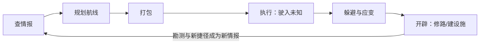
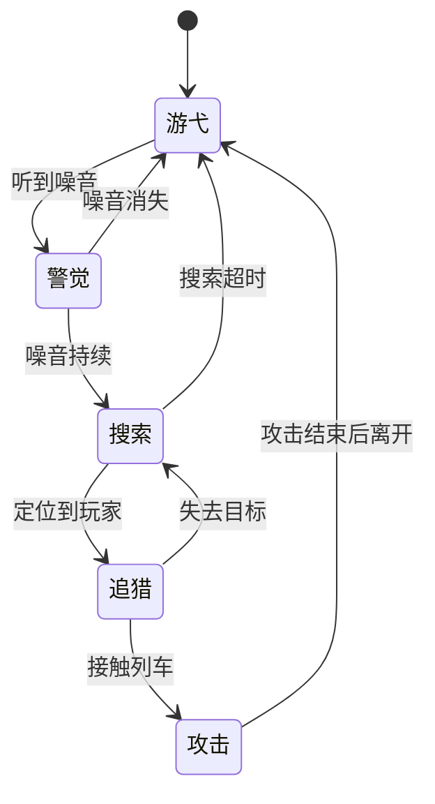
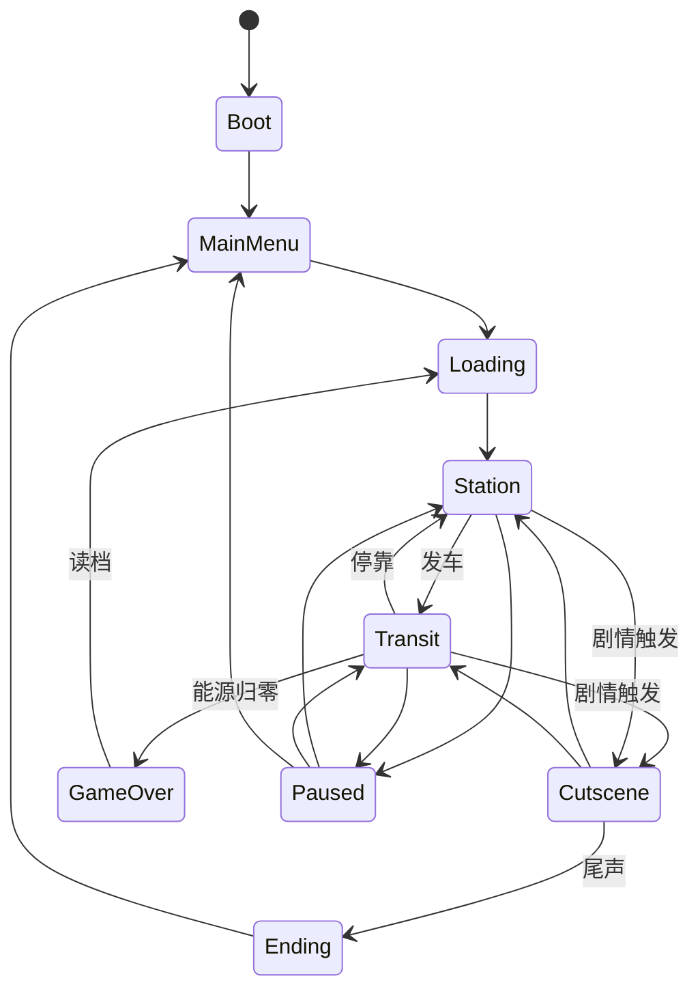
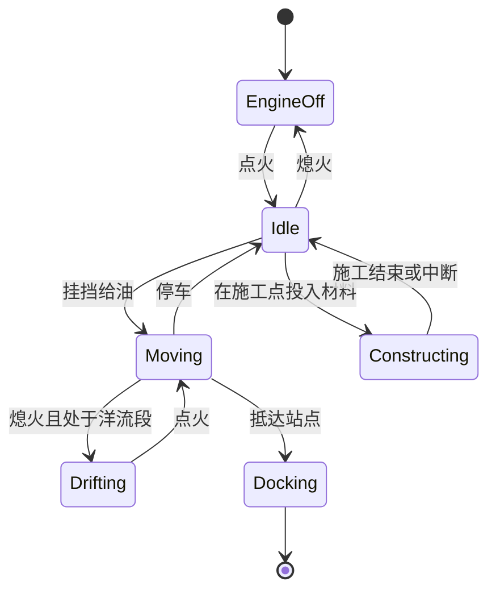

# 雾航司机 Fogline Driver 系统设计规范 v6.1

Oct 5, 2026 · @Charlie

## 0. 版本说明

v6.1 从第一性原理重新收敛了玩法：**地图本身就是游戏**。本文件是所有系统的唯一规范，取代 v6.0；与本文件冲突的旧设计一律以本文件为准。世界观仍沿用《雾潜者 GDD v5.0》。相对 v6.0 的变更汇总见第 15 章。

## 1. 总则

### 1.1 一句话定位

坐在封闭的轨道车里，对着一张不可靠的旧线路图查情报、规划航线、驶入未知、躲开雾中的猎手，把一条条断轨修成自己的网络。

### 1.2 核心体验（按优先级）

1. **规划**：在海图上综合勘测、通告与潮汐预测，找出一条可行的路，像看地铁图想换乘、像航海家看海图算潮窗。
2. **驶入未知**：把路线押进只有旧地图的区域，亲眼看着声纳把真实地形一点点扫出来。
3. **冷静应对压迫**：环境是持续的主要威胁，猎手是偶尔逼近的心理压力。玩家能做的只有停、退、换线、熄火、藏。
4. **开辟**：在有限材料下选择修哪几条路、在哪些节点建设施，让网络和捷径成形，像银河城打开捷径、像 Mini Motorways 和 MST 那样做网络设计。

### 1.3 核心循环

打包、送货、打捞是辅助系统：打包服务于规划，送货提供目的地，打捞奖励进入未知。它们保持浅而清晰，不追求深度。

### 1.4 设计铁律

- **海图铁律**：所有情报都以海图标记的形式呈现，带位置、时间、来源、可信度四个属性。没有独立的情报、日志或任务界面。
- **视角铁律**：驾驶阶段玩家始终在驾驶舱内，主屏就是海图；不存在车外视角。
- **轨道铁律**：列车只能沿轨道移动。建造只发生在节点和边上，所有可建的边和设施位都是预设的，并且**数量始终多于玩家能获得的材料**。
- **世界铁律**：雾海是一片连续空间，轨道网络只是嵌在其中的一张图。环境场和猎手存在于连续雾海中，不受轨道约束。
- **单一生命值铁律**：**能源**是唯一决定生死的数值，只能通过格子物品（燃料罐）或在站点恢复。
- **空间铁律**：货物、燃料罐、工具、建造材料共用同一套车厢格子。
- **噪音铁律**：所有发声或发射信号的行为都会计入噪音，噪音是猎手追踪玩家的唯一依据。
- **无货币铁律**：游戏中没有货币。报酬直接以物品、材料、情报的形式发放。
- **叙事铁律**：剧情线性、单结局；阵营只存在于叙事中，不做声望系统。
- **站点铁律**：站点不做可自由行走的 3D 场景，只做固定视角的站台界面。

### 1.5 范围边界（明确不做）

- 不做交易、市场、价格系统和货币。
- 不做自由铺轨，也不做轨道编辑器。
- 不做车外战斗和武器，对抗手段只有规避、诱饵、隐藏和逃跑。
- 不做多结局和阵营声望。
- 不做多人联机。
- 暂不做其他列车与调度系统（远期可能加入其他轨道运输员，届时另行设计）。

## 2. 世界模型

世界在逻辑上是 2D 的：一张俯视的雾海，深度只是一个标量。3D 只负责驾驶舱外壳和站台场景。

### 2.1 三层结构

| 层 | 内容 | 谁在上面移动 |
| --- | --- | --- |
| **雾海** | 连续空间，包括深度场、洋流场和地形（山脊、隧道等，会遮挡声音） | 猎手、雾象 |
| **轨道图** | 节点（站点、道岔、残骸、施工点、设施位）和边（轨道段） | 列车 |
| **时间** | 全局时钟，驱动潮汐、洋流变化、预报事件和委托期限 | — |

### 2.2 节点类型

| 类型 | 说明 |
| --- | --- |
| 站点 | 可停靠，进入站台界面；可能接入网络并提供产出 |
| 道岔 | 线路分叉点，行驶中可切换方向 |
| 残骸 | 可打捞的节点，是探索的奖励 |
| 设施位 | 可以建造信标、中继站或避难所的预设位置 |
| 施工点 | 候选边的端点，投入材料后开通对应的边 |

### 2.3 边的状态

| 状态 | 说明 |
| --- | --- |
| 已开通 | 可以通行 |
| 断轨 | 原本存在、现已损坏的边，修复后开通 |
| 候选 | 可以新建的预设边，旧地图上可能有、也可能没有 |
| 未知 | 旧地图上画着，但从未被勘测确认，实际状态可能和图上不同 |

## 3. 海图

海图是游戏的主舞台：它既是驾驶舱主屏（CAB-01），也是站台的海图台（STN-05）。除车辆仪表和车厢格子外，所有信息都在海图上呈现。设计参考真实海运：航海图、航海通告（Notice to Mariners）、NAVTEX 航行警告、潮汐表，以及电子海图系统 ECDIS。

### 3.1 三个图层

| 图层 | 内容 | 可信度 | 视觉 |
| --- | --- | --- | --- |
| **旧地图** | 旧时代印刷的线路图，开局即拥有 | 不可靠：有的线已断，有的站已改名，有的路图上没有 | 泛黄的印刷底图 |
| **勘测层** | 列车走过的边、声纳扫过的地形，自动写入 | 写入时可靠，但会随时间变旧 | 清晰的实线和等深线 |
| **标注层** | 玩家的手动标记，以及雾航通告、站点勘测图等外部情报 | 取决于来源 | 手写或印章风格的标记 |

旧地图的作用是**引导与定位**：让玩家认出自己大致在世界的哪个位置。真正可靠的规划依据是勘测层。路线一旦伸进只有旧地图的区域，就是在押注，这正是探索。

### 3.2 标记模型

每条情报都是海图上的一个标记：

| 属性 | 说明 | 示例 |
| --- | --- | --- |
| 位置 | 节点、边，或雾海中的一个区域 | 5号线 K12 处 |
| 时间 | 观测时刻或预测时刻 | 3 小时前 / 预计 18:00 |
| 来源 | 自己勘测、站点、雾航通告、其他司机、匿名信号 | 灯塔站调度台 |
| 可信度 | 决定标记的显示方式：实线、虚线、问号 | 高 / 中 / 低 |

- **标记会过期**：猎手的目击标记随时间褪色，勘测数据也会变旧（例如乱流改变了地形）。
- 标记类型包括：断轨、地形变化、猎手目击、雾象预警、残骸、信号源，以及玩家的自由标注。

### 3.3 情报渠道

渠道只负责把情报写进海图，本身不是独立系统。

| 渠道 | 写入什么 | 时机 |
| --- | --- | --- |
| 被动声纳 | 列车周围的地形，写入勘测层 | 行驶中持续写入 |
| 主动声纳 | 前方远处的地形和回波轮廓，写入勘测层 | 玩家发波时 |
| 站点勘测图 | 附近区段的勘测数据，来源标为该站点（参考空洞骑士的 Cornifer） | 停靠时，或作为委托报酬 |
| 雾航通告 | 断轨、雾象预警、猎手目击等广播，自动标到图上 | 行驶中通过电台接收 |
| 剧情通话 | 剧情语音照常播放，同时在图上留下相关标记 | 由委托触发 |

### 3.4 时间轴

- 海图下方有一条时间滑杆，向未来拖动可以查看**预测的潮位、洋流和预报事件**。
- 拖得越远，预测越模糊：显示范围变宽，可信度下降。
- **雾啸**等事件以不确定性锥的形式显示，类似台风路径预报图。
- 潮汐有固定周期，可以精确预测；雾啸只能靠预报，并且预报不一定准。

### 3.5 航线规划

- 玩家在海图上点选节点和道岔，画出一条航线。
- 航线会显示：
  - 总距离；
  - **预计能源消耗**：只覆盖已勘测路段，未知路段显示为区间；
  - 沿途经过的深度和洋流，以及其中超过耐压上限的路段；
  - 与时间轴联动的到达时刻，以及该时刻的潮位。
- 航线只是计划，不会自动驾驶。行驶中可以随时偏离或重新规划。

## 4. 驾驶执行

### 4.1 操作

| 操作 | 说明 |
| --- | --- |
| 点火 / 熄火 | 熄火后绝对静音，但无法自主移动（洋流段可以滑行） |
| 方向手柄 | 前进 / 空挡 / 后退 |
| 油门推杆 | 连续可调，给油有延迟 |
| 刹车 | 急刹会产生高噪音 |
| 道岔预选 | 在海图上点击前方道岔，切换分支 |

列车在主屏海图上显示为一个实时移动的点。驾驶就是在海图上看着这个点、控制它的速度和方向。

### 4.2 速度的三方取舍

速度越快，**噪音越大、能源消耗越快**，但到达更早，更容易赶上潮窗。**快、静、省三者只能兼顾两个**，这是驾驶阶段最核心的持续决策。

### 4.3 声纳

- **被动声纳**：常开、静默、耗电极低。持续把列车周围的地形写入勘测层，并在海图上显示附近声源的方位和强度。猎手的信号也在这里出现。
- **主动声纳**：长按发波，消耗大量能源，并产生高噪音。能看清前方远处的地形和回波轮廓，结果写入勘测层；回波轮廓随时间褪色。
- 主动声纳是"进入未知"时的核心工具：它把押注变成已知，代价是暴露自己。

### 4.4 电台

- 电台**只接收**，用于收听雾航通告和剧情通话，接收到的情报自动写入海图（见 3.3）。
- v6.1 不做发射（PTT），需要回应的剧情使用文本选项。

## 5. 环境

环境是主要威胁。所有雾象都是雾海中的连续场或局部事件，玩家通过所经过的边来感受它们。

### 5.1 雾压与耐压

- **雾压 = 深度**，是最核心的环境数值。雾海中每一处都有深度，每条边的深度由其所经过的位置决定。
- 列车有**耐压上限**，可以通过升级提高，这是银河城式的主要进度门槛。
- 超过耐压上限属于**软门槛**：仍然可以进入，但能源消耗随超出量急剧上升，怕压货物也会受损。略微超出可以冒险冲过去，大幅超出则必死无疑。

### 5.2 雾象

| 雾象 | 形态 | 对玩家的影响 |
| --- | --- | --- |
| 潮汐 | 全局雾面周期性升降 | 所有深度随时间变化：涨潮时，原本安全的路段可能超过耐压上限；退潮时，可能露出新的通路 |
| 洋流 | 连续流场，可随时间变化 | 顺流省能源，熄火时可以滑行；逆流加倍消耗 |
| 寒流 | 局部区域 | 经过时持续额外消耗能源 |
| 乱流 | 局部区域 | 颠簸会损伤易碎货物，并提高噪音 |
| 漩涡 | 特殊节点 | 把列车卷向指定方向，或强制改道 |
| 雾啸 | 罕见的预报事件 | 大范围的极端深度涌浪，必须及时赶到避难所或站点 |

最小切片只实现雾压、潮汐、洋流（见第 14 章）。

## 6. 猎手

### 6.1 定位

猎手不是常驻的敌人，而是一种**持续的心理压力**。玩家感知到它的次数，应该远多于真正和它遭遇的次数。

### 6.2 规则

- 猎手在连续雾海中自由移动，不受轨道约束。
- 它**只靠噪音追踪**玩家。可听范围随噪音强度扩大，会被地形（山脊、隧道）遮挡。
- 它可能**停留在轨道上**，堵住玩家的必经之路，逼迫玩家重新规划。

### 6.3 行为阶段

- **攻击**：大量扣除能源，并可能损坏货物。攻击本身不会直接导致游戏结束，但可能让能源归零。

### 6.4 玩家的应对

| 应对 | 代价 |
| --- | --- |
| 熄火静等 | 能源缓慢流失，潮窗可能关闭 |
| 投放声诱饵 | 消耗一格物品 |
| 躲进避难所 | 避难所隔音，猎手会失去目标；前提是已经建好 |
| 利用地形 | 绕远路走隧道或山脊后的线路 |
| 加速逃离 | 噪音更大，能源消耗更快 |

## 7. 资源

### 7.1 资源表

| 资源 | 类型 | 占格子 | 获得 | 消耗 | 说明 |
| --- | --- | --- | --- | --- | --- |
| **能源** | 生死数值 | 否 | 燃料罐、站点补满 | 行驶、主动声纳、超压、寒流、野外怠速、猎手攻击 | 归零即游戏结束 |
| 噪音 | 瞬时数值 | 否 | 所有发声行为 | 随时间自然衰减 | 猎手追踪的依据 |
| 耐压上限 | 长期进度 | 否 | 使用耐压合金升级 | — | 银河城的主要门槛 |
| 燃料罐 | 格子物品 | 是 | 委托报酬、站点产出、打捞 | 使用后恢复能源 | 相当于生化危机的草药 |
| 工具 | 格子物品 | 是 | 委托报酬、站点产出、打捞 | 使用 | 例如声诱饵、固定带（防颠簸货损）、压载（临时提高耐压） |
| 委托货物 | 格子物品 | 是 | 接受委托 | 交付 | 带属性标签，见 9.2 |
| 轨件 | 建造材料 | 是 | 委托报酬、站点产出、打捞 | 修建普通的边、建设施 | 通用材料 |
| 耐压合金 | 建造材料 | 是 | 主线和人物委托报酬、深处打捞 | 修建深处的边、升级耐压 | 稀有，是银河城的钥匙 |

### 7.2 设计原则

- 车厢格子的核心张力是：**这一趟要带多少燃料罐求稳、带多少材料做长期投资、带多少工具应对路上的雾象**。
- 建造材料只有两种。新增材料种类之前，必须证明现有两种无法表达某个重要的取舍。

### 7.3 数值平衡原则

- 每趟行程的能源消耗约为满能源的 40%–70%，逼迫玩家携带燃料罐，或者规划途经站点的路线。
- 主动声纳单次消耗约为满能源的 8%–12%。
- 任何时刻，候选边与设施位的总造价约为玩家可获得材料的 2–3 倍，确保"修哪条"始终是取舍。

## 8. 建网

### 8.1 修路

- 断轨和候选边都是预设的。每条边的造价、深度和沿途雾象各不相同。
- 修路需要把材料**实际运到施工点**，因此修路本身也是一趟运输。
- 材料可以分多次投入，进度永久保留。施工过程会耗时并产生噪音。
- 边开通后，自动在勘测层上标为已开通。

### 8.2 节点设施

设施只能建在预设的设施位上。

| 设施 | 作用 |
| --- | --- |
| 信标 | 持续发声，可以作为长期诱饵，把猎手引离某片区域 |
| 中继站 | 扩展被动声纳的覆盖范围，并在其范围内提高雾航通告的接收质量 |
| 避难所 | 隔音；可以在其中躲避猎手和雾啸，并恢复少量能源 |

### 8.3 网络产出

- 站点**接入网络**的条件：它与起点站之间存在一条全部已开通的路径。
- 每次停靠已接入网络的站点，都能领取少量物资（燃料罐、轨件或工具，每个站点类型固定）。
- 因此"先连哪个站"本身就是一个战略选择，玩家需要像构造生成树一样考虑连接顺序。

## 9. 驱动力

### 9.1 委托

| 委托类型 | 来源 | 作用 |
| --- | --- | --- |
| 主线委托 | 剧情推进 | 手写；推进主线，报酬通常包含耐压合金 |
| 人物委托 | 固定收货人 | 手写；连续交付后解锁该人物的故事段落，并给出新的目的地或勘测图 |
| 派单 | 站点调度台 | 程序化生成；作为补给来源，报酬是燃料罐、轨件和工具 |

- **委托就是钥匙**：送到货的同时，往往会打开新的委托、情报或建网机会。送货、建网、推进剧情合为一件事。
- 委托之外的另一个驱动力是**好奇心**：海图上看得见但去不了的地方，例如断掉的线、雾中的站名、只收到一半的信号。

### 9.2 货物属性

| 属性 | 效果 |
| --- | --- |
| 怕压 | 超过阈值深度会受损 |
| 易碎 | 颠簸、急刹、乱流会受损 |
| 发声 | 持续叠加噪音 |
| 活物 / 易变质 | 有时限 |

- 货物受损会降低报酬，完全损毁则委托失败。货物状态是每件货物自己的状态，不计入能源。

## 10. 时间

- **行驶中**，时间实时流逝，具体比例待定（见第 16 章）。
- **站台中**，时间暂停，但玩家可以主动选择"等待到某一时刻"，例如等退潮再出发。
- 时间驱动：潮汐、洋流变化、雾啸预报、委托期限、货物时限，以及猎手目击标记的褪色。
- **时间的代价**：在野外熄火等待会缓慢消耗能源；潮窗会关闭；有期限的委托会到期。

## 11. 玩法循环

### 11.1 单趟循环（示例）

委托：把一箱药送到灯塔站，报酬是 1 块耐压合金。

| # | 阶段 | 玩家行为与决策 |
| --- | --- | --- |
| 0 | 获得目标 | 读委托：药箱占 2×2 格、怕压；目的地已在旧地图上标出。 |
| 1 | 读图 | 比较航线：A 线近，但有断轨，后半段未勘测；B 线已勘测，但中段很深。 |
| 2 | 查情报 | 拖动时间轴：18:00 涨潮后，B 线深段会超过耐压上限。通告标记显示，A 线 2号站附近有猎手目击，已是 3 小时前。 |
| 3 | 打包 | 药箱、燃料罐 ×2、轨件 ×3、声诱饵 ×1。多带一罐燃料求稳，还是多带轨件修捷径？ |
| 4 | 行驶 | 控制速度，在快、静、省之间权衡；被动声纳持续扫出地形。 |
| 5 | 修路 | 在断轨处投入轨件。全部投入，还是留一个以防万一？ |
| 6 | 进入未知 | 旧地图上的线实际已经偏移。发主动声纳看清前方，还是慢速盲开？ |
| 7 | 猎手信号 | 熄火静等、投放诱饵、加速冲过去，三选一。时间、能源、噪音在这里交汇。 |
| 8 | 意外发现 | 旧地图上没有的岔路尽头有一处残骸。现在去打捞？格子满了丢什么？还是先标记下来？ |
| 9 | 抵达 | 交付，获得合金；灯塔站接入网络；收货人提到另一个地方，下一个目的地出现。 |

### 11.2 阶段循环（一幕）

1. 抵达新区域，大部分只有旧地图，勘测层几乎空白。
2. 接取本幕主线委托，得知需要到达的深处目标。
3. 通过人物委托和派单积累材料与勘测数据。
4. 在候选边与设施位之间做取舍，建出自己的网络。
5. 用耐压合金提升耐压上限，打开更深的区域。
6. 完成本幕最后一单主线委托，进入下一幕。

### 11.3 长期循环（整局）

- **空间**：从青藏岛周边逐步向深处延伸，直至零号海沟。
- **车辆**：耐压上限逐级提高，车厢格子逐步扩充。
- **网络**：勘测层逐步覆盖旧地图，玩家建出的网络让往返越来越快、越来越安全。
- **叙事**：序幕（黑盒）→ 第一幕（漩涡）→ 第二幕（航线）→ 第三幕（深渊）→ 尾声，沿用 v5.0 的剧情结构，由主线委托串联。

## 12. 界面

驾驶舱和站台内的界面都是 3D 空间中的实体面板；只有系统界面使用 2D 菜单。

### 12.1 系统界面（2D）

| 编号 | 界面 | 内容 |
| --- | --- | --- |
| SYS-01 | 启动/标题 | 开始、继续、设置、退出 |
| SYS-02 | 存档选择 | 存档列表，显示当前幕、所在站点、游戏时长 |
| SYS-03 | 设置 | 画面、音频、按键 |
| SYS-04 | 暂停菜单 | 继续、设置、返回标题 |
| SYS-05 | 加载 | 过场加载 |
| SYS-06 | 游戏结束 | 失败原因、读取最近存档 |

### 12.2 驾驶舱界面（3D 实体，行驶中）

| 编号 | 界面 | 位置 | 内容 |
| --- | --- | --- | --- |
| CAB-01 | 主海图屏 | 正前方，默认视角 | 海图（全部图层）、列车位置、航线、声纳回波、时间轴 |
| CAB-02 | 仪表面板 | 主屏下方 | 能源、当前雾压/耐压上限、速度、噪音计、时钟 |
| CAB-03 | 操纵台 | 主屏两侧 | 点火、方向手柄、油门推杆、刹车、主动声纳发波键、电台旋钮 |
| CAB-04 | 车厢视图 | 按 Shift 转身 | 当前车厢格子，可以使用燃料罐和工具、整理物资 |

### 12.3 站台界面（固定视角）

| 编号 | 界面 | 内容 |
| --- | --- | --- |
| STN-01 | 站台总览 | 站名、是否接入网络、可前往的功能窗口、发车 |
| STN-02 | 委托板 | 可接委托、已接委托、交付；领取网络产出 |
| STN-03 | 装载 | 全车厢编组视图，整理货物和物资 |
| STN-04 | 车间 | 升级耐压、扩充车厢 |
| STN-05 | 海图台 | 大尺寸海图，用于规划航线、查看时间轴、等待到某一时刻 |
| STN-06 | 施工 | 所需材料、已投入进度、投入操作（仅在施工点或设施位相邻的站点出现） |
| STN-07 | 仓库 | 仅在已接入网络的站点可用，用于存放物品 |

### 12.4 叠加层

| 编号 | 叠加层 | 触发 |
| --- | --- | --- |
| OVL-01 | 电台字幕 | 收到通告或剧情通话 |
| OVL-02 | 交互提示 | 视线停留在可操作的面板上 |
| OVL-03 | 警报 | 超压、能源过低、货物受损 |
| OVL-04 | 剧情对话选择 | 需要回应剧情时，提供文本选项 |
| OVL-05 | 教程提示 | 首次遇到新机制 |

### 12.5 跳转规则

- 顶层：SYS-01 → SYS-02 → SYS-05 → STN-01；STN-01 发车进入 CAB-01，停靠后回到 STN-01；能源归零进入 SYS-06。
- 驾驶舱内切换面板只是视角移动，游戏不暂停。转身看车厢（CAB-04）期间，列车保持当前方向和油门，这是有意设计的风险。
- 所有站台子界面只能返回 STN-01。例外：在 STN-02 接单后，可以一键进入 STN-03 装载委托货物。
- **发车前置条件**：所有已接委托的货物都已装车；能源大于零。航线规划是可选的。
- 任意界面按 Esc 进入 SYS-04；叠加层不改变当前界面和游戏状态，警报（OVL-03）优先级最高。

## 13. Game State 状态机

### 13.1 全局状态

| 状态 | 时间流逝 | 可存档 | 说明 |
| --- | --- | --- | --- |
| Boot | — | 否 | 初始化服务、读取设置 |
| MainMenu | 否 | 否 | SYS-01/02/03 |
| Loading | 否 | 否 | 加载场景和存档数据 |
| Station | 否（可主动等待） | 是（自动） | 所有站台界面 |
| Transit | 是 | 否 | 所有驾驶舱界面 |
| Cutscene | 视剧情 | 否 | 固定演出 |
| Paused | 否 | 否 | 记录暂停前的状态，恢复时返回 |
| GameOver | 否 | 否 | 显示失败原因 |
| Ending | 否 | 否 | 尾声与制作名单 |

### 13.2 Transit 子状态

- 猎手不再作为 Transit 的子状态，而是一个**并行运行的独立系统**（见 6.3）。玩家在任何子状态下都可能被它察觉。

### 13.3 车辆状态（并行）

| 字段 | 类型 | 说明 |
| --- | --- | --- |
| energy | float | 唯一的生死数值 |
| noise | float | 当前噪音强度，随时间衰减 |
| pressureLimit | float | 耐压上限 |
| position | (edgeId, t) | 当前所在的边，以及在边上的位置 |
| direction | enum 前进/空挡/后退 | 方向手柄 |
| throttle | float 0–1 | 油门推杆 |
| speed | float | 当前速度 |
| consist | list | 车厢编组及各车厢的格子内容 |

### 13.4 存档数据

- 当前幕、委托进度、人物委托进度。
- 世界时间。
- 勘测层、标注层以及所有标记（含时间戳）。
- 已开通的边、各施工点的投入进度、已建设施。
- 耐压上限、车厢编组与格子内容、仓库内容。
- 当前所在站点（只在 Station 存档，所以读档一定回到站台）。

## 14. 最小切片范围与验收标准

第一个可玩切片的目标，是验证"**查情报 → 规划 → 驶入未知 → 躲避 → 开辟**"这个循环本身是否好玩。

### 14.1 切片内容

| 项目 | 数量 | 说明 |
| --- | --- | --- |
| 区域 | 1 个 | 青藏岛外围，旧地图上约有 3 条线 |
| 节点 | 12–16 个 | 其中站点 4 个，其余为道岔、残骸、施工点、设施位 |
| 候选边 / 断轨 | 4–5 条 | 材料只够修其中 2–3 条 |
| 设施 | 1 种 | 避难所 |
| 环境 | 3 种 | 雾压、潮汐、洋流 |
| 猎手 | 1 种 | 噪音追踪型 |
| 货物种类 | 5 种 | 覆盖怕压、易碎、发声、易变质 |
| 工具 | 2 种 | 声诱饵、固定带 |
| 建造材料 | 2 种 | 轨件、耐压合金 |
| 委托 | 1 条主线 + 1 条人物 + 派单 | 主线为黑盒序幕 |

### 14.2 系统实现顺序

1. GameState 状态机与 Station/Transit 切换。
2. 世界数据：轨道图（节点和边）与雾海的深度场。
3. 海图渲染与列车沿边移动（方向、油门、道岔）。
4. 能源、噪音、耐压与超压。
5. 时间系统、潮汐、洋流，以及时间轴预测。
6. 被动与主动声纳，写入勘测层。
7. 格子装载与货物属性。
8. 站台界面：委托板、装载、海图台、车间。
9. 标记模型与雾航通告。
10. 修路、避难所与网络产出。
11. 猎手 AI（连续空间移动、噪音感知、地形遮挡）。
12. 主线委托与剧情通话。

### 14.3 验收标准

- [ ] 玩家能在不看教程的情况下，用海图规划一条航线并完成一次委托。
- [ ] 每趟出发前，玩家至少面临一次"多带燃料还是多带材料"的取舍。
- [ ] 至少有一次规划需要用时间轴避开涨潮。
- [ ] 至少有一次路线押进未勘测区域，并且实际情况与旧地图不同。
- [ ] 至少出现一次需要通过管理噪音来应对猎手的时刻；而且整趟切片中，"察觉到猎手"的次数明显多于"被猎手攻击"的次数。
- [ ] 修通一条边之后，玩家能明显感到往返变短或更安全；并且不同玩家选择的修路组合可以不同。
- [ ] 读档一定回到站台，状态与存档前一致。

## 15. 相对 v6.0 的变更

| 项目 | v6.0 | v6.1 |
| --- | --- | --- |
| 核心 | 七个并列的玩法模块 | 以海图为中心的单一循环 |
| 驾驶舱 | 多个面板分散显示信息 | 主屏就是海图 |
| 交易 | 缺货/余货标签、价格计算、以物换物 | **删除** |
| 货币 | 配给券 | **删除**，报酬直接给物品 |
| 生死数值 | 燃料、电量、分区完整度 | **统一为能源**，用燃料罐恢复 |
| 主要威胁 | 怪物 | **环境**；猎手是持续的心理压力 |
| 怪物移动 | 未明确 | 在连续雾海中自由移动 |
| 环境 | 雾压、洋流 | 雾压与潮汐联动，另有洋流、寒流、乱流、漩涡、雾啸 |
| 情报 | 电台是唯一的情报来源 | 统一为海图标记，电台只是渠道 |
| 地图 | 线路图面板 | 旧地图 / 勘测层 / 标注层三层，外加时间轴 |
| 修路 | 修复预设断点 | 在多于资源的候选边中做选择，外加节点设施和网络产出 |
| 电台 | 接收 + PTT 发射 | 只接收 |
| 声学共振 | 有 | **删除** |
| 挡位 | P/R/N/D/L | 方向手柄 + 油门推杆 |

## 16. 待定问题

1. **能源的正式名称**：炉温、电量还是别的，需要符合世界观。
2. **时间比例**：行驶中现实 1 秒对应多少游戏时间，以及潮汐周期的长度。
3. **猎手攻击**：具体的能源扣除量和货损规则，需要在切片中调试。
4. **剧情回应**：除了文本选项之外，以后是否恢复 PTT 发射。
5. **其他轨道运输员**：远期加入时，是否引入调度、信号与共享网络。
