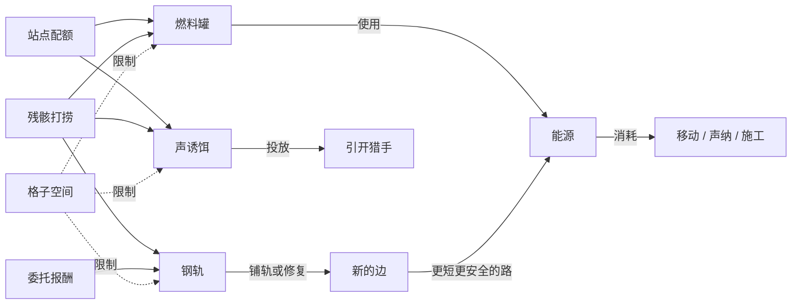

# 雾航司机 MVP Demo 计划

Oct 5, 2026 · @Charlie

## 1. 目标

本文件定义第一个可玩 demo 的范围。游戏本身的设计以《Fogline Driver v6.1》为准；本文件只规定 demo 做 v6.1 中的哪些部分、做到什么程度。

demo 有两个目的：

1. **自己验证手感**：核心循环"查情报 → 规划 → 驶入未知 → 躲避 → 开辟"是否好玩。
2. **给有游戏制作经验的朋友试玩并收集意见**。

由此得出的硬性要求：

- 核心循环的**五个动作都要能玩到**。只做其中一部分，验证不了循环本身。
- 可以是灰盒，但**不需要开发者在旁边解释**也能玩懂。
- **一次玩完**，时长 20–40 分钟。
- 结束后能**收集到意见**，并留下可以对照的客观数据。
- **所有数值和关卡数据都做成 ScriptableObject，可在 Inspector 中配置**。本文件中的数值都是初始值，靠试玩调整。

## 2. 故事背景与地点

完整游戏的旅程从中国最高的**青藏高原**出发，一路向东走向海边：海拔逐渐降低，雾越来越深，雾压越来越高。

demo 截取旅程**最开头的一小段**：**青藏岛东缘的林芝一带**。这里海拔最高、雾最浅，正是一名新司机学会在雾里开车的地方。地名取自这一带的真实地理，营造中国城市与地铁线路的氛围。

## 3. 地图

地图完全按 v6.1 第 2、7 章的规则推导：**先画地形，再由地形和潮汐推出深度、雾压、潮流、声音遮挡和猎手的活动范围。**

### 3.1 基准数值

| 项目 | 初始值 |
| --- | --- |
| 地图大小 | 约 6 km × 4.5 km；高度图每像素 10 m（600 × 450） |
| 雾面平均高度 | 200 m |
| 潮汐 | ±15 m，周期 12 游戏小时；雾面在 185–215 m 之间 |
| 时间比例 | 现实 1 秒 = 游戏 1 分钟（潮汐一个周期约 12 分钟） |
| 雾压 | 雾面处为 1，每深 10 m 增加 1 |
| 列车耐压上限 | 深度 100 m（雾压 11） |
| 怕压货物承压阈值 | 深度 85 m |
| 猎手活动范围 | 深度 ≥ 60 m |
| 重力与制动 | 坡度力度 × 重力系数（初始值待调）；再生制动回收效率 40% |
| 列车速度 | 全速约 16 m/s；安静巡航约 7 m/s；铺轨爬行约 4 m/s（堤道 1.25 km 约 5 分钟，刚好塞进一个退潮窗口） |

### 3.2 地形

| 地貌 | 地形高度 | 深度（退潮 / 平均 / 涨潮） | 推导结果 |
| --- | --- | --- | --- |
| **北部浅台** | 170–185 m | 0–45 m | 浅、安全；猎手永远到不了 |
| **色季拉垭口**（八一与鲁朗之间的山口） | 195 m | 0 / 5 / 20 m | 最高点；退潮时露出雾面 |
| **鲁朗**（尼洋洼西缘） | 150 m | 35 / 50 / 65 m | 平时安全；涨潮时猎手可以游到站外 |
| **尼洋洼**（谷底） | 128 m | 57 / 72 / 87 m | 退潮：猎手进不来；平均潮位：猎手可以进入；涨潮：怕压货物受损 |
| **雅江水道**（尼洋洼通往东方外海的深沟） | 80 m | 105 / 120 / 135 m | **猎手的巢**，任何时候都有猎手 |
| **峡口**（苯日岭上的低鞍部） | 145 m | 40 / 55 / 70 m | 只有涨潮时深度才超过 60 m，这时尼洋洼与巴松湾连通，猎手可以穿过来 |
| **巴松湾**（北侧的海湾） | 135 m | 50 / 65 / 80 m | 平均潮位以上，猎手可以在湾里活动；但它必须先在涨潮时穿过峡口才能进湾 |
| **苯日岭**（中央山岭） | 190–210 m | 0–25 m | 分隔尼洋洼与北部浅台，挡住谷底传来的声音 |
| **南迦岭**（东侧山岭） | 230 m | 0 m | 永远高出雾面；东隧道从岭下穿过 |

**谷地水道与潮流：**

| 水道 | 涨潮时 | 落潮时 |
| --- | --- | --- |
| 雅江水道（外海 ↔ 尼洋洼） | 往西流入尼洋洼 | 往东流出 |
| 峡口（尼洋洼 ↔ 巴松湾） | 被淹没后才有流，流向北 | 停流 |
| 湾口（外海 ↔ 巴松湾） | 往南流入湾内 | 往北流出 |

### 3.3 线路图

```
                           北方外海
                    ~~~~~~~ 湾口 ~~~~~~~
 八一 ━━━ J1 ━━━ J5 ━━━ J6 ┄┄ 巴松湾堤道（候选）┄┄ 米林        北部浅台
  站      ┃      ┃       ╲        巴松湾          ╱  ┃          站
          ┃    布久       R1╳                    ╱   ┃ 东隧道（穿过南迦岭）
          ┃    残骸        ╲                    ╱    ┃
      色季拉垭口            J3 ━━━━━━━━━━━━━━━╯     ┃
          ┃            桥 ╱   ↑ 峡口（涨潮时连通）    ┃
          ┃  苯日北坡线 ━╯         （苯日岭）         ┃
          ┃   ╱                                     J4 ━━ 雅江残骸
        鲁朗 ━ J2                                  ╱          ╲
         站     ╲━━━━━━━━ 尼洋洼线（谷底）━━━━━━━━╯       雅江水道 → 东方外海
                                                           （猎手的巢）
```

### 3.4 节点（11 个）

| 类型 | 节点 | 说明 |
| --- | --- | --- |
| 站点 | **八一站** | 起点和终点；雾航司气象台也设在这里，负责播报潮汐预报 |
| 站点 | **鲁朗站** | 尼洋洼西缘；监听范围覆盖尼洋洼 |
| 站点 | **米林站** | 巴松湾东岸；自带道岔（连接 3 号线、东隧道和巴松湾堤道）；监听范围覆盖巴松湾 |
| 道岔 | J1 – J6 | J1：去鲁朗，还是去 J5。J2：走尼洋洼线，还是走苯日北坡线。J3：3 号线与北坡线的交汇处。J4：尼洋洼线、东隧道与雅江残骸支线的交汇处。J5：去布久残骸，还是继续向东。J6：3 号线与巴松湾堤道的交汇处 |
| 端点 | **布久残骸** | 北部浅台上，安全；有 2 件钢轨 |
| 端点 | **雅江残骸** | 雅江水道边缘，深度 90 / 105 / 120 m，**只有退潮时才不会超压**，而且靠近猎手的巢；有声诱饵和燃料罐 |

### 3.5 边

| 边 | 线路 | 长度 | 推导出的特点 |
| --- | --- | --- | --- |
| 八一 – J1 | 1 号线 | 1.0 km | 北部浅台，开局已勘测 |
| J1 – 色季拉垭口 – 鲁朗 | 1 号线 | 1.8 km | 先爬坡再下坡；下坡段 800 m 未勘测，陡坡上有一处**落石** |
| J1 – J5 – J6 | 3 号线 | 1.2 km | 北部浅台 |
| J5 – 布久残骸 | 支线 | 0.5 km | 旧地图上没有 |
| J6 – J3 | 3 号线 | 1.4 km | 沿巴松湾湾顶绕行；**R1 断轨**位于靠近峡口的一侧 |
| J3 – 米林 | 3 号线 | 1.6 km | 北部浅台东段 |
| 鲁朗 – J2 | 2 号线 | 0.3 km | — |
| **尼洋洼线** J2 – J4 | 2 号线 | 2.6 km | 谷底，深度随潮汐剧烈变化；东段靠近雅江水道入口 |
| **苯日北坡线** J2 – 桥 – J3 | 支线 | 2.8 km | 沿苯日岭北坡爬升，**山岭挡住了谷底的声音**；中段的**桥**跨过峡口，桥上暴露；涨潮时猎手可能从桥下穿过 |
| 东隧道 J4 – 米林 | 2 号线 | 0.9 km | 穿过南迦岭，完全隔音 |
| J4 – 雅江残骸 | 支线 | 0.4 km | 下坡进入雅江水道边缘 |
| **巴松湾堤道** J6 – 米林 | 候选 | 1.25 km（5 段） | 横跨巴松湾湾口；轨道筑在堤上，深度 45 / 60 / 75 m；斜穿湾口潮流 |

**结构**（见 v6.1 2.4）：苯日北坡线中段是**桥**（跨过峡口），东隧道是**隧道**，巴松湾堤道是**堤**，其余都是**地面**。所有边都是普通轨。

### 3.6 旧地图与现实的差异

- 3 号线在旧地图上是完好的，实际在 R1 处断了。
- 尼洋洼线在旧地图上是一条直线，实际沿谷底蜿蜒。
- 苯日北坡线、布久支线、雅江支线，旧地图上都没有。北坡线要靠鲁朗站的勘测图才知道。
- 巴松湾堤道在旧地图上印成一条"规划中"的虚线：旧时代计划修建、但从未建成。

## 4. 三趟委托

| 趟 | 路线 | 引入的内容 |
| --- | --- | --- |
| **第一趟** | 八一 → 鲁朗 | 组合手柄、方向手柄、道岔、停靠；被动与主动声纳；旧地图与勘测层；落石 |
| **第二趟** | 鲁朗 → 米林 | 时间轴与潮汐；潮流；雾航通告；猎手；声诱饵 |
| **第三趟** | 米林 → 八一 | 修断轨、铺轨模式；材料与格子的取舍 |

### 4.1 第一趟：八一 → 鲁朗（约 2.8 km）

- **货物**：易碎箱（2×2）。
- 翻越色季拉垭口：上坡耗能，下坡要提前制动；陡坡上的落石需要靠主动声纳提前发现。
- **可选绕路**：在 J1 往东、在 J5 拐进支线，可以发现布久残骸，并打捞到 2 件钢轨。这会影响第三趟。
- 停靠鲁朗站时，获得一张**站点勘测图**，揭示旧地图上没有画的苯日北坡线。

### 4.2 第二趟：鲁朗 → 米林（运送怕压仪器，有交付期限）

- **货物**：怕压仪器（2×3），承压阈值 85 m，**有交付期限**。
- 鲁朗站的监听范围覆盖尼洋洼，所以它的广播里可能出现真实的猎手目击通告。

| 路线 | 长度 | 由地形推出的特点 |
| --- | --- | --- |
| **尼洋洼线 + 东隧道** | 3.8 km | **退潮**：谷底深度低于 60 m，猎手被挡在雅江水道里，落潮流还在背后推着列车走。**平均潮位**：猎手可以进入谷底。**涨潮**：怕压仪器受损。东段要贴着雅江水道入口经过，任何潮位都必须保持安静 |
| **苯日北坡线 + 桥** | 4.7 km | 全程浅，任何潮位都能走；爬坡耗能更多。山岭挡住了谷底的声音，**唯一的暴露点是桥**：如果涨潮时过桥，猎手可能正从峡口穿过 |

交付期限让"在站台等退潮"不再是免费的最优解：**等，还是不等；走哪条路**，需要对着时间轴计算。

### 4.3 第三趟：米林 → 八一（运送发声货物，回家）

- **货物**：发声货物（2×2），会持续产生噪音。
- **材料**：米林站的交付报酬是 4 件钢轨；第一趟如果打捞了布久残骸，还有 2 件。

| 选项 | 造价 | 回程 | 由地形推出的风险 |
| --- | --- | --- | --- |
| 不修 | 0 | 经苯日北坡线和鲁朗站绕回，约 7.5 km | 很远，而且要再过一次桥 |
| **修 R1** | 2 件钢轨 | 米林 → J3 → R1 → J6 → 八一，约 5.2 km | R1 靠近峡口，涨潮时修理的噪音可能引来穿过峡口的猎手 |
| **铺巴松湾堤道** | 5 件钢轨 | 米林 → 堤道 → J6 → 八一，约 3.45 km | 横跨巴松湾，铺轨很吵；涨潮且峡口连通时，猎手可以进湾 |

- **打捞过布久残骸（共 6 件钢轨）**：可以铺完堤道；剩下 1 件，不够修 R1。
- **没打捞（共 4 件钢轨）**：铺不完堤道，只能修 R1，或者铺出一条通向湾里的死胡同。
- 两个选项都和潮汐有关：**挑退潮时动工**，就是这一趟的核心技巧。

## 5. 资源

### 5.1 资源表

| 资源 | 形态 | 来源 | 用途 |
| --- | --- | --- | --- |
| **能源** | 数值，满值 100 | 停靠站点时补满；燃料罐 | 移动（安静巡航约 6 / km，全速约 10 / km，爬坡额外消耗）、主动声纳（每次 10）、超压、铺轨（每段 3）、修复与清理；被猎手攻击扣 30 |
| **噪音** | 瞬时数值 | 牵引、制动、主动声纳、施工、发声货物 | 决定声音能传多远 |
| **燃料罐** | 补给，1×2 | 站点配额、打捞 | 使用后恢复 25 能源 |
| **声诱饵** | 投放物，1×1 | 站点配额、打捞雅江残骸 | 装填进发射器后发射，落地后持续发声一段时间 |
| **钢轨** | 材料，1×2，重 | 第二趟报酬、打捞布久残骸 | 修断轨（R1 缺口约 400 m，覆盖 2 段，需要 2 件）、铺轨（地面段和堤段每段 1 件） |
| **委托货物** | 格子物品 | 委托 | 见第 4 章 |

### 5.2 站点配额

没有货币，所以每个站点的物资是**有限的免费配额**：

| 站点 | 配额 |
| --- | --- |
| 八一站 | 燃料罐 ×3、声诱饵 ×1 |
| 鲁朗站 | 燃料罐 ×2 |
| 米林站 | 燃料罐 ×2、声诱饵 ×1 |

真正限制玩家带多少的，是车厢格子：**6×4，共 24 格**。钢轨很重，6 件钢轨会明显拖慢爬坡、拉长制动距离。例如第三趟带上发声货物（4 格）、6 件钢轨（12 格）、2 罐燃料（4 格）和 1 个声诱饵（1 格），一共 21 格，几乎塞满。多带一罐燃料，还是多带两件钢轨，就是那一趟的取舍。

### 5.3 资源转化路径



- **能源**是生存，只能靠燃料罐和停靠来补充。
- **钢轨**是投资，把一次性的材料变成永久的路，以后每趟都能省能源。
- **格子空间**是两者共同的约束，所以"今天活下来"和"以后更轻松"始终在抢同一块地方。

### 5.4 能源余量

估算口径：安静巡航每 km 6 能源，全速每 km 10 能源，每趟发 2–3 次主动声纳；满能源 100，一罐燃料 25。

| 趟 | 路线 | 预计消耗（满能源的百分比） | 曲线意图 |
| --- | --- | --- | --- |
| 1 | 八一 → 鲁朗 | 约 45–65% | 余量很大，用来学操作 |
| 1 | 加上布久绕路 | 约 65–85% | 第一次觉得"该带一罐燃料" |
| 2 | 尼洋洼线 | 约 50–70% | 省能源，但要赌潮汐 |
| 2 | 苯日北坡线 | 约 60–85% | 安全，但爬坡费能源，配合期限，余量变小 |
| 3 | 不修，绕远路 | 约 75–105% | 必须用燃料罐 |
| 3 | 修 R1 / 铺堤道 | 约 55–75% | 投资在这一趟当场回本 |

稀缺的东西也在变化：第一趟紧张的是能源，第二趟是时间和能源，第三趟车厢被钢轨塞满，**紧张的东西变成了空间和重量**。

### 5.5 平衡检查

模拟核心是纯 C#，所以写一个 EditMode 测试：读取 ScriptableObject 里的数值，计算每趟委托每条路线在三个潮位下的消耗，断言：

- 每趟至少有一条安全路线，单靠"满能源 + 站点配额"就能走完；
- 满载时所有必经的坡都爬得上去；
- 不打捞时钢轨仍然够修 R1（4 ≥ 2）；
- 最优路线的余量至少 20。

在 Inspector 里改了数值，跑一遍测试就知道曲线还对不对。再用试玩日志里真实的能源曲线校准估算。

## 6. 可配置项

所有数据都做成 ScriptableObject，在 Inspector 中配置，不写死在代码里。至少包括：

| 类别 | 可配置内容 |
| --- | --- |
| 世界 | 雾面平均高度、潮汐振幅与周期、雾压换算、时间比例 |
| 地形 | 高度图、像素尺寸、谷地水道（走向、宽度、流速系数） |
| 线路 | 节点（类型、位置、名称）、边（曲线、轨道高程、隧道与桥梁区段、状态、已铺长度）、缺陷（类型、位置）、旧地图（示意图的形状、"规划中"的线路、与现实不符之处） |
| 列车 | 耐压上限、能源上限、各种消耗、速度、质量、组合手柄级位（含再生与摩擦制动的分界）、再生回收效率、最大牵引力、重力系数、车厢格子尺寸 |
| 侦测 | 被动声纳范围、主动声纳的消耗与蓄力曲线、测向仪参数、发射器（装填时间、射程曲线、落点误差、发射噪音） |
| 声音 | 距离衰减、地形遮挡的衰减量、各类行为产生的噪音 |
| 猎手 | 活动范围的深度阈值、各阶段速度、听觉、警觉值曲线、攻击效果、硬直值与习惯曲线 |
| 物品 | 尺寸、重量、属性（怕压阈值、易碎、发声）、效果 |
| 站点 | 物资配额、监听半径、广播覆盖半径、播出时段、勘测图内容 |
| 委托 | 起点、终点、货物、期限、报酬、电台文字 |

## 7. 不做与简化

### 7.1 不做

- 全部升级系统（车辆配置固定）。
- EMP 型猎手。
- 寒流、乱流、漩涡、雾啸、深海声道。
- 节点设施（v6.1 中待重新设计）。
- 示意视图。
- 仓库、换装、多节车厢。
- 耐压合金与深处铺轨。
- 网络产出。
- 存档与读档（一次玩完）。
- 主菜单以外的系统界面、设置界面、过场演出。
- 手柄支持。

### 7.2 简化

| 项目 | v6.1 | demo |
| --- | --- | --- |
| 站台界面 | STN-01 至 STN-07 | 合并成**一个界面**，分三栏：委托（接受、交付）、装载（车厢格子和站点物资）、海图台（航线规划、时间轴、"等待到…"、发车） |
| 剧情 | 剧情通话、对话选择 | 只有电台文字，没有选项 |
| 标注 | 图标 + 一句话 | 只有预设图标，不需要打字 |
| 失败 | 游戏结束，读取存档 | 能源归零后，从最近一次停靠的站点重来（内存快照，不写盘） |
| 侦测 | 测向仪需要升级获得 | 测向仪预装，让试玩者体验到三角定位 |
| 材料 | 钢轨、石料、耐压合金 | 只有钢轨；堤道按 5 件钢轨计算，不需要石料 |
| 轨道等级 | 普通、无缝、高速、磁悬浮 | 只有普通轨，没有改造模式 |
| 投放物 | 多种 | 只有声诱饵；装填位 1 个 |
| 猎手压制 | 硬直、引开、隔绝、困住 | 全部按 v6.1 规则保留，不额外做内容 |
| 视图 | 三个视图 + 图层面板 | 三个视图都做（看坡和看潮都是核心判断）；洋流先用箭头，不做粒子；不做图层面板 |

### 7.3 新增（demo 专用）

- **试玩日志**：自动记录到本地文件，包括：
  - 每趟用时、走过的路线、出发时的潮位；
  - 能源曲线；
  - 主动声纳发波次数；
  - 察觉猎手的次数和被攻击的次数；
  - 扳错道岔、撞上缺陷的次数；
  - 收到的通告，以及收到后是否改变了航线；
  - 第三趟选择修哪条路，以及动工时的潮位。
- **反馈问卷**：demo 结束后在游戏内弹出，全部用鼠标操作。问题围绕核心循环的五个动作，以及"最紧张的时刻"、"最困惑的时刻"。
- **按键提示**：第一次需要某个操作时，在海图屏角落提示一次（v6.1 的 OVL-02）。

## 8. 输入与交互

完全遵循 v6.1 第 15.6 节，只有以下差异：

- 标注只能选预设图标，不能附文字。
- 车厢格子的右键菜单只有"使用"（燃料罐）和"装填"（声诱饵）。

## 9. 验收标准

- [ ] 试玩者在不看说明、无人讲解的情况下，能完成第一趟委托。
- [ ] 试玩者能自己在海图上拼出航线，而不是只沿着高亮路线开。
- [ ] 每趟出发前，试玩者至少面临一次"多带燃料还是多带材料"的取舍。
- [ ] 第二趟中，试玩者使用时间轴规划了出发时刻或路线，或者因为没看时间轴而吃到了后果，并且能理解原因。
- [ ] 至少有一次路线押进未勘测区域，并且实际情况与旧地图不同。
- [ ] 至少有一次试玩者在未知路段权衡"发主动声纳后加速"还是"低速前进"。
- [ ] 扳错或忘扳道岔时，试玩者能理解发生了什么，并自己倒车纠正。
- [ ] "察觉到猎手"的次数明显多于"被猎手攻击"的次数。
- [ ] 至少收到一次由真实观测产生的猎手目击通告，并且试玩者据此改变了路线或出发时刻。
- [ ] 试玩者能说出"深处危险、高处安全"，或者"涨潮时更危险"这类由地形推出的规律。
- [ ] 第三趟中，至少有一次在铺轨时，声纳扫出了此前未知的地形。
- [ ] 修好一条路后，返程明显变短或更安全；不同试玩者选择修的路可以不同。
- [ ] 每次试玩都生成完整的试玩日志和问卷结果。

## 10. 实现顺序

按风险排序：**最不确定是否好玩的部分最先做**，确定能做出来的部分往后放。

1. **驾驶原型**：地形高度图、轨道图（曲线边、轨道高程、道岔）、海图渲染（四个图层、等高线、航行/地形/雾况三个视图、近景/远景）、列车物理与操纵（方向手柄、组合手柄、再生与摩擦制动、质量、坡度、牵引力上限、道岔）。
2. **环境与生存**：能源、噪音、深度与雾压、耐压；时间、潮汐、潮流；时间轴预测。
3. **侦测与声音**：声音传播与地形遮挡；被动与主动声纳；发射器（Space 蓄力、鼠标瞄准、1/2 选弹种、装填）；边上的缺陷；接触目标三级显示；测向仪自动三角定位。
4. **猎手**：活动范围、最后听见的位置、警觉值、攻击；声诱饵。
5. **站点循环**：停靠与发车、合并的站台界面、委托、车厢格子与货物属性。
6. **开辟**：断轨修复、铺轨模式、落石清理。
7. **雾航通告**：观测、广播时段、覆盖范围、网络转播、接收；气象台潮汐预报。
8. **内容**：按第 3、4 章搭建地图与三趟委托；按键提示；失败重来。
9. **试玩支持**：试玩日志、反馈问卷、打包。

第 1 步完成后，先自己试开一次。如果"在海图上开车"本身不好玩，后面的步骤都要重新考虑。

## 11. 后续待定

- **脚本架构**：模拟核心与 Unity 表现层如何划分，以及 ScriptableObject 的具体拆分，下一步讨论后补充到本文件或单独的架构文档。
- **高度图的绘制**：需要验证第 3.2 节的地形能否画出来，并让各条线路的深度恰好落在表中的范围。
- **问卷的具体题目**。
